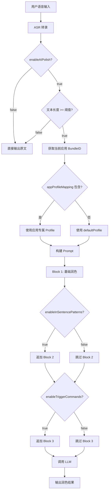

# 设计文档

## 概述

本设计文档描述 AI 润色功能的技术实现方案。该功能将 AI 润色从偏好设置中独立出来，作为 Dashboard 侧边栏的独立 Section，提供润色配置文件（Profile）系统和智能指令功能。

### 核心目标

1. 在 Dashboard 侧边栏新增「AI 润色」导航项
2. 实现润色配置文件系统，支持 6 种预设风格和应用专属配置
3. 实现智能指令功能（句内模式识别 + 句尾唤醒指令）
4. 动态拼接 Prompt（Block 1 + Block 2 + Block 3）

## 架构

### 整体架构

```
┌─────────────────────────────────────────────────────────────┐
│                      Dashboard                               │
├─────────────┬───────────────────────────────────────────────┤
│             │                                                │
│  Sidebar    │              Content Area                      │
│  ┌───────┐  │  ┌─────────────────────────────────────────┐  │
│  │概览   │  │  │                                         │  │
│  │记录   │  │  │         AIPolishPage                    │  │
│  │随心记 │  │  │                                         │  │
│  │AI润色 │◄─┼──│  ┌─────────────────────────────────┐   │  │
│  │偏好设置│  │  │  │ 基础设置                        │   │  │
│  └───────┘  │  │  │ 润色配置                        │   │  │
│             │  │  │ 智能指令                        │   │  │
│             │  │  └─────────────────────────────────┘   │  │
│             │  └─────────────────────────────────────────┘  │
└─────────────┴───────────────────────────────────────────────┘
```

### 数据流



## 组件和接口

### 1. NavItem 扩展

```swift
// NavItem.swift
enum NavItem: String, CaseIterable, Identifiable {
    case overview = "概览"
    case memo = "随心记"
    case library = "历史库"
    case aiPolish = "AI 润色"  // 新增
    case preferences = "偏好设置"
    
    var icon: String {
        switch self {
        case .overview: return "chart.bar.fill"
        case .memo: return "note.text"
        case .library: return "clock.arrow.circlepath"
        case .aiPolish: return "wand.and.stars"  // 新增
        case .preferences: return "gearshape.fill"
        }
    }
}
```

### 2. PolishProfile 枚举

```swift
// PolishProfile.swift
enum PolishProfile: String, CaseIterable, Identifiable {
    case standard = "默认"
    case professional = "专业/商务"
    case casual = "轻松/社交"
    case concise = "简洁"
    case creative = "创意/文学"
    case custom = "自定义"
    
    var id: String { rawValue }
    
    var description: String {
        switch self {
        case .standard: return "去口语化、修语法、保原意"
        case .professional: return "正式书面语，适合邮件、报告"
        case .casual: return "保留口语感，只修错别字"
        case .concise: return "精简压缩，提炼核心"
        case .creative: return "润色+美化，增加修辞"
        case .custom: return "使用自定义 Prompt"
        }
    }
    
    var prompt: String {
        // 返回对应的 Block 1 Prompt
    }
}
```

### 3. AIPolishPage 视图

```swift
// AIPolishPage.swift
struct AIPolishPage: View {
    @StateObject private var viewModel = AIPolishViewModel()
    
    var body: some View {
        ScrollView {
            VStack(alignment: .leading, spacing: DS.Spacing.xl) {
                // 页面标题
                Text("AI 润色")
                    .font(DS.Typography.largeTitle)
                
                // 基础设置区块
                basicSettingsSection
                
                // 润色配置区块
                profileSettingsSection
                
                // 智能指令区块
                smartCommandsSection
            }
        }
    }
}
```

### 4. AIPolishViewModel

```swift
// AIPolishViewModel.swift
@Observable
class AIPolishViewModel {
    // 基础设置
    var enableAIPolish: Bool
    var polishThreshold: Int
    
    // 配置文件
    var defaultProfile: PolishProfile
    var appProfileMapping: [String: PolishProfile]
    var customProfilePrompt: String
    
    // 智能指令
    var enableInSentencePatterns: Bool
    var enableTriggerCommands: Bool
    var triggerWord: String
    
    // 方法
    func addAppMapping(bundleId: String, profile: PolishProfile)
    func removeAppMapping(bundleId: String)
    func getProfileForApp(bundleId: String?) -> PolishProfile
}
```

### 5. PromptBuilder 服务

```swift
// PromptBuilder.swift
class PromptBuilder {
    static func buildPrompt(
        profile: PolishProfile,
        customPrompt: String?,
        enableInSentencePatterns: Bool,
        enableTriggerCommands: Bool,
        triggerWord: String
    ) -> String {
        var prompt = ""
        
        // Block 1: 基础润色
        if profile == .custom, let custom = customPrompt {
            prompt += custom
        } else {
            prompt += profile.prompt
        }
        
        // Block 2: 句内模式识别
        if enableInSentencePatterns {
            prompt += "\n\n" + PromptTemplates.block2
        }
        
        // Block 3: 句尾唤醒指令
        if enableTriggerCommands {
            let block3 = PromptTemplates.block3
                .replacingOccurrences(of: "{{trigger_word}}", with: triggerWord)
            prompt += "\n\n" + block3
        }
        
        return prompt
    }
}
```

### 6. DoubaoLLMService 扩展

```swift
// DoubaoLLMService.swift 扩展
extension DoubaoLLMService {
    func polishWithProfile(
        text: String,
        profile: PolishProfile,
        customPrompt: String?,
        enableInSentencePatterns: Bool,
        enableTriggerCommands: Bool,
        triggerWord: String,
        completion: @escaping (Result<String, Error>) -> Void
    ) {
        let systemPrompt = PromptBuilder.buildPrompt(
            profile: profile,
            customPrompt: customPrompt,
            enableInSentencePatterns: enableInSentencePatterns,
            enableTriggerCommands: enableTriggerCommands,
            triggerWord: triggerWord
        )
        
        sendRequest(systemPrompt: systemPrompt, userMessage: text, completion: completion)
    }
}
```

## 数据模型

### AppSettings 扩展

```swift
// AppSettings.swift 新增属性
class AppSettings: ObservableObject {
    // 现有属性...
    
    // AI 润色配置文件
    @Published var defaultProfile: String {
        didSet { saveToUserDefaults() }
    }
    
    @Published var appProfileMapping: [String: String] {
        didSet { saveToUserDefaults() }
    }
    
    @Published var customProfilePrompt: String {
        didSet { saveToUserDefaults() }
    }
    
    // 智能指令
    @Published var enableInSentencePatterns: Bool {
        didSet { saveToUserDefaults() }
    }
    
    @Published var enableTriggerCommands: Bool {
        didSet { saveToUserDefaults() }
    }
    
    @Published var triggerWord: String {
        didSet { saveToUserDefaults() }
    }
}
```

### UserDefaults Keys

```swift
private enum Keys {
    // 现有 keys...
    
    // 新增 keys
    static let defaultProfile = "defaultProfile"
    static let appProfileMapping = "appProfileMapping"
    static let customProfilePrompt = "customProfilePrompt"
    static let enableInSentencePatterns = "enableInSentencePatterns"
    static let enableTriggerCommands = "enableTriggerCommands"
    static let triggerWord = "triggerWord"
}
```

### 默认值

| 设置项 | 类型 | 默认值 |
|--------|------|--------|
| enableAIPolish | Bool | false |
| polishThreshold | Int | 20 |
| defaultProfile | String | "默认" |
| appProfileMapping | [String: String] | [:] |
| customProfilePrompt | String | "" |
| enableInSentencePatterns | Bool | true |
| enableTriggerCommands | Bool | true |
| triggerWord | String | "Ghost" |


## 正确性属性

*正确性属性是一种在系统所有有效执行中都应保持为真的特征或行为——本质上是关于系统应该做什么的形式化陈述。属性作为人类可读规范和机器可验证正确性保证之间的桥梁。*

### Property 1: 禁用润色时直接返回原文

*For any* 输入文本，当 enableAIPolish 为 false 时，润色服务应直接返回原始文本，不做任何修改。

**Validates: Requirements 2.3**

### Property 2: 短文本跳过润色

*For any* 输入文本，当文本长度小于 polishThreshold 时，润色服务应跳过 AI 润色，直接返回原始文本。

**Validates: Requirements 2.4**

### Property 3: 应用映射的添加和删除

*For any* BundleID 和 Profile 组合，添加映射后应能查询到该映射；删除映射后该 BundleID 应不再存在于映射中。

**Validates: Requirements 4.3, 4.4**

### Property 4: Profile 查找逻辑

*For any* BundleID，如果 appProfileMapping 包含该 BundleID，则 getProfileForApp 应返回对应的 Profile；否则应返回 defaultProfile。

**Validates: Requirements 4.6, 4.7**

### Property 5: Prompt 包含 Block 1

*For any* PolishProfile，构建的 Prompt 应始终包含该 Profile 对应的 Block 1 内容。

**Validates: Requirements 7.1**

### Property 6: Prompt 条件包含 Block 2

*For any* 配置组合，当 enableInSentencePatterns 为 true 时，构建的 Prompt 应包含 Block 2 内容；为 false 时不应包含。

**Validates: Requirements 5.2, 7.2**

### Property 7: Prompt 条件包含 Block 3 并替换唤醒词

*For any* 配置组合和任意唤醒词，当 enableTriggerCommands 为 true 时，构建的 Prompt 应包含 Block 3 内容，且 {{trigger_word}} 占位符应被替换为实际唤醒词。

**Validates: Requirements 6.3, 6.4, 7.3, 7.4**

### Property 8: 设置持久化 Round-Trip

*For any* 设置值组合，保存到 UserDefaults 后重新加载，应得到相同的值。

**Validates: Requirements 3.4, 8.1, 8.2, 8.3, 8.4, 8.5, 8.6, 8.7, 8.8**

## 错误处理

### 网络错误

| 错误场景 | 处理方式 |
|---------|---------|
| LLM API 请求超时 | 返回原始文本，显示提示 |
| LLM API 返回错误 | 返回原始文本，记录日志 |
| 网络不可用 | 返回原始文本，显示离线提示 |

### 数据错误

| 错误场景 | 处理方式 |
|---------|---------|
| UserDefaults 读取失败 | 使用默认值 |
| appProfileMapping 格式错误 | 重置为空字典 |
| 无效的 Profile 名称 | 回退到「默认」Profile |

### 应用检测错误

| 错误场景 | 处理方式 |
|---------|---------|
| 无法获取当前应用 BundleID | 使用 defaultProfile |
| BundleID 为 nil | 使用 defaultProfile |

## 测试策略

### 单元测试

单元测试用于验证特定示例和边界情况：

1. **NavItem 测试**
   - 验证 aiPolish 在 allCases 中的位置
   - 验证 aiPolish.icon == "wand.and.stars"

2. **PolishProfile 测试**
   - 验证 allCases 包含 6 种配置
   - 验证每种配置的 prompt 非空

3. **默认值测试**
   - 验证 enableAIPolish 默认为 false
   - 验证 polishThreshold 默认为 20
   - 验证 defaultProfile 默认为「默认」
   - 验证 enableInSentencePatterns 默认为 true
   - 验证 enableTriggerCommands 默认为 true
   - 验证 triggerWord 默认为「Ghost」

### 属性测试

属性测试用于验证跨所有输入的通用属性。使用 Swift 的 swift-testing 框架配合自定义生成器。

**配置要求**：
- 每个属性测试至少运行 100 次迭代
- 每个测试必须引用设计文档中的属性编号
- 标签格式：**Feature: ai-polish, Property {number}: {property_text}**

**属性测试列表**：

1. **Property 1 测试**: 禁用润色时直接返回原文
   - 生成随机文本
   - 设置 enableAIPolish = false
   - 验证输出 == 输入

2. **Property 2 测试**: 短文本跳过润色
   - 生成长度 < polishThreshold 的随机文本
   - 验证输出 == 输入

3. **Property 3 测试**: 应用映射的添加和删除
   - 生成随机 BundleID 和 Profile
   - 添加映射，验证可查询
   - 删除映射，验证不存在

4. **Property 4 测试**: Profile 查找逻辑
   - 生成随机 BundleID 和映射
   - 验证存在时返回映射值
   - 验证不存在时返回 defaultProfile

5. **Property 5 测试**: Prompt 包含 Block 1
   - 遍历所有 PolishProfile
   - 验证构建的 Prompt 包含对应内容

6. **Property 6 测试**: Prompt 条件包含 Block 2
   - 生成随机配置
   - 验证开关为 true 时包含 Block 2
   - 验证开关为 false 时不包含 Block 2

7. **Property 7 测试**: Prompt 条件包含 Block 3 并替换唤醒词
   - 生成随机唤醒词
   - 验证开关为 true 时包含 Block 3
   - 验证 {{trigger_word}} 被替换

8. **Property 8 测试**: 设置持久化 Round-Trip
   - 生成随机设置值
   - 保存到 UserDefaults
   - 重新加载
   - 验证值相等
