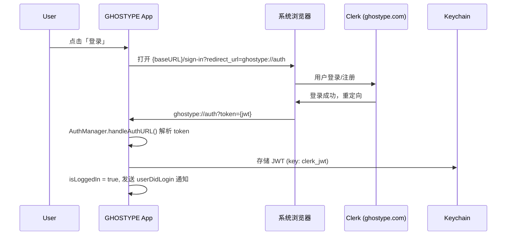
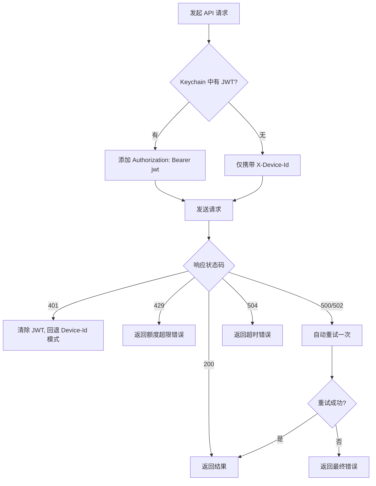

# 设计文档

## 概述

本设计将 GHOSTYPE macOS 客户端从直接调用 Google Gemini API 迁移为调用 GHOSTYPE 后端 API。核心变更包括：

1. 新建 `GhostypeAPIClient` 替代 `GeminiService`，统一处理润色/翻译请求
2. 完善 `AuthManager`，实现 Clerk 浏览器登录 → URL Scheme 回调 → JWT 存储的完整流程
3. 重构 `QuotaManager`，从本地 CoreData 秒数额度改为服务端字符额度
4. 迁移 `PolishProfile` 和 `TranslateLanguage` 枚举的 rawValue 从中文到英文，并处理旧数据兼容
5. 修改 `AppDelegate` 中的调用链路，从 `GeminiService` 切换到 `GhostypeAPIClient`

## 架构

### 当前架构

```
AppDelegate.processWithMode()
    ↓
GeminiService.polishWithProfile() / translate()
    ↓ (直接调用 Gemini API)
Google Gemini API
```

### 目标架构

```
AppDelegate.processWithMode()
    ↓
GhostypeAPIClient.polish() / translate()
    ↓ (携带 X-Device-Id + Bearer JWT)
GHOSTYPE Backend (POST /api/v1/llm/chat)
    ↓ (服务端调用 Gemini，处理 Prompt 缓存)
Google Gemini API
```

### 鉴权流程



### 请求鉴权流程



## 组件与接口

### 1. GhostypeAPIClient（新建）

替代 `GeminiService`，位于 `Features/AI/GhostypeAPIClient.swift`。

```swift
class GhostypeAPIClient {
    static let shared = GhostypeAPIClient()

    private var baseURL: String {
        #if DEBUG
        return "http://localhost:3000"
        #else
        return "https://ghostype.com"
        #endif
    }

    /// 润色文本
    func polish(
        text: String,
        profile: String,
        customPrompt: String?,
        enableInSentence: Bool,
        enableTrigger: Bool,
        triggerWord: String
    ) async throws -> String

    /// 翻译文本
    func translate(
        text: String,
        language: String
    ) async throws -> String

    /// 获取用户配置和额度
    func fetchProfile() async throws -> ProfileResponse

    /// 内部：构建通用请求 Header
    private func buildRequest(url: URL, method: String, timeout: TimeInterval) -> URLRequest

    /// 内部：执行请求并处理错误（含重试逻辑）
    private func performRequest<T: Decodable>(_ request: URLRequest, retryOn500: Bool) async throws -> T
}
```

### 2. AuthManager（完善现有）

补全 `Features/Auth/AuthManager.swift` 中缺失的方法。

```swift
class AuthManager: ObservableObject {
    // 已有属性: isLoggedIn, userId, userEmail, signInURL, signUpURL, baseURL

    /// 初始化时从 Keychain 恢复登录状态
    private init()

    /// 打开浏览器登录
    func openLogin()

    /// 打开浏览器注册
    func openSignUp()

    /// 处理 URL Scheme 回调
    func handleAuthURL(_ url: URL)

    /// 登出
    func logout()

    /// 获取当前 JWT（供 API Client 使用）
    func getToken() -> String?

    /// 处理 401 响应（清除 JWT，回退）
    func handleUnauthorized()
}
```

### 3. QuotaManager（重构）

从本地 CoreData 秒数额度改为服务端字符额度。

```swift
@Observable
class QuotaManager {
    // 新属性
    private(set) var usedCharacters: Int      // 已用字符数
    private(set) var limitCharacters: Int      // 字符上限（-1 表示无限）
    private(set) var resetAt: Date?            // 下次重置时间
    private(set) var plan: String              // "free" 或 "pro"
    private(set) var isLifetimeVip: Bool

    // 计算属性
    var isUnlimited: Bool                      // limit == -1
    var usedPercentage: Double                 // 已用百分比
    var formattedUsed: String                  // "1234 / 6000 字符"
    var formattedResetTime: String             // "3 天后重置"

    /// 从服务器刷新额度数据
    func refresh() async

    /// 用 ProfileResponse 更新本地状态
    func update(from response: ProfileResponse)
}
```

### 4. PolishProfile（修改枚举 rawValue）

```swift
enum PolishProfile: String, CaseIterable, Identifiable {
    case standard = "standard"           // 原 "默认"
    case professional = "professional"   // 原 "专业"
    case casual = "casual"               // 原 "活泼"
    case concise = "concise"             // 原 "简洁"
    case creative = "creative"           // 原 "创意"

    /// 迁移旧中文 rawValue
    static func migrate(oldValue: String) -> PolishProfile?
}
```

### 5. TranslateLanguage（从 GeminiService 内嵌枚举提取为独立枚举）

```swift
enum TranslateLanguage: String, CaseIterable {
    case chineseEnglish = "chineseEnglish"   // 原 "中英互译"
    case chineseJapanese = "chineseJapanese" // 原 "中日互译"
    case auto = "auto"                       // 原 "自动检测"

    /// 迁移旧中文 rawValue
    static func migrate(oldValue: String) -> TranslateLanguage?

    /// UI 显示名称（通过 L.xxx 本地化）
    var displayName: String
}
```

### 6. AppDelegate 调用链路变更

```swift
// 变更前
GeminiService.shared.polishWithProfile(text:profile:customPrompt:...) { result in ... }
GeminiService.shared.translate(text:language:) { result in ... }

// 变更后
Task {
    do {
        let result = try await GhostypeAPIClient.shared.polish(
            text: text,
            profile: resolved.profile.rawValue,
            customPrompt: resolved.customPrompt,
            enableInSentence: settings.enableInSentencePatterns,
            enableTrigger: settings.enableTriggerCommands,
            triggerWord: settings.triggerWord
        )
        // 主线程插入文本
    } catch {
        // 回退插入原文
    }
}
```

### 7. 数据迁移服务（新建）

位于 `Features/Settings/MigrationService.swift`，在应用启动时执行一次性迁移。

```swift
struct MigrationService {
    /// 在 AppDelegate.applicationDidFinishLaunching 中调用
    static func runIfNeeded()

    /// 迁移 PolishProfile rawValue: 中文 → 英文
    private static func migratePolishProfile()

    /// 迁移 TranslateLanguage rawValue: 中文 → 英文
    private static func migrateTranslateLanguage()

    /// 迁移 selectedProfileId 和 appProfileMapping 中的旧值
    private static func migrateProfileMappings()
}
```

## 数据模型

### API 请求模型

```swift
struct GhostypeRequest: Codable {
    let mode: String           // "polish" | "translate"
    let message: String
    var profile: String?       // 仅 polish 模式
    var custom_prompt: String? // 仅 profile == "custom" 时
    var enable_in_sentence: Bool?
    var enable_trigger: Bool?
    var trigger_word: String?
    var translate_language: String?  // 仅 translate 模式
}
```

### API 响应模型

```swift
struct GhostypeResponse: Codable {
    let text: String
    let usage: Usage
    struct Usage: Codable {
        let input_tokens: Int
        let output_tokens: Int
    }
}

struct GhostypeErrorResponse: Codable {
    let error: ErrorDetail
    struct ErrorDetail: Codable {
        let code: String
        let message: String
    }
}
```

### 用户配置响应模型

```swift
struct ProfileResponse: Codable {
    let subscription: SubscriptionInfo
    let usage: UsageInfo

    struct SubscriptionInfo: Codable {
        let plan: String
        let status: String?
        let is_lifetime_vip: Bool
        let current_period_end: String?
    }

    struct UsageInfo: Codable {
        let used: Int
        let limit: Int
        let reset_at: String
    }
}
```

### 错误枚举

```swift
enum GhostypeError: LocalizedError {
    case unauthorized(String)
    case quotaExceeded(String)
    case invalidRequest(String)
    case serverError(code: String, message: String)
    case timeout
    case networkError(Error)

    var errorDescription: String? { ... }
}
```

### 枚举迁移映射

```swift
// PolishProfile 迁移映射
let polishMigrationMap: [String: String] = [
    "默认": "standard",
    "专业": "professional",
    "活泼": "casual",
    "简洁": "concise",
    "创意": "creative"
]

// TranslateLanguage 迁移映射
let translateMigrationMap: [String: String] = [
    "中英互译": "chineseEnglish",
    "中日互译": "chineseJapanese",
    "自动检测": "auto"
]
```


### 8. ASR 凭证云端获取（新增）

将 DoubaoSpeechService 的 ASR 凭证（`app_id`、`access_token`）从本地 .env 环境变量迁移为从服务器动态获取。客户端启动时请求凭证，缓存到内存，后续 WebSocket 连接直接使用缓存值。

#### API 端点

```
GET {Base_URL}/api/v1/asr/credentials
```

请求 Header：
```
X-Device-Id: {DeviceIdManager.shared.deviceId}
```

响应模型：
```swift
struct ASRCredentialsResponse: Codable {
    let app_id: String
    let access_token: String
}
```

#### DoubaoSpeechService 变更

```swift
class DoubaoSpeechService: ObservableObject {
    // 替换原有的 getenv 读取逻辑
    private var cachedAppId: String = ""
    private var cachedAccessToken: String = ""

    /// 从服务器获取 ASR 凭证，缓存到内存
    func fetchCredentials() async throws {
        let baseURL: String = {
            #if DEBUG
            return "http://localhost:3000"
            #else
            return "https://ghostype.com"
            #endif
        }()
        let url = URL(string: "\(baseURL)/api/v1/asr/credentials")!
        var request = URLRequest(url: url)
        request.setValue(DeviceIdManager.shared.deviceId, forHTTPHeaderField: "X-Device-Id")
        request.timeoutInterval = 10

        let (data, response) = try await URLSession.shared.data(for: request)
        guard let httpResponse = response as? HTTPURLResponse,
              httpResponse.statusCode == 200 else {
            throw GhostypeError.serverError(code: "ASR_CREDENTIALS_FAILED", message: "获取 ASR 凭证失败")
        }
        let credentials = try JSONDecoder().decode(ASRCredentialsResponse.self, from: data)
        self.cachedAppId = credentials.app_id
        self.cachedAccessToken = credentials.access_token
    }

    // appId / accessToken 改为读取缓存
    private var appId: String { cachedAppId }
    private var accessToken: String { cachedAccessToken }
}
```

#### AppDelegate 启动集成

在 `applicationDidFinishLaunching` 中，`loadDotEnv()` 之后、用户可触发录音之前调用：

```swift
Task {
    do {
        try await speechService.fetchCredentials()
        logToFile("[App] ASR credentials fetched successfully")
    } catch {
        logToFile("[App] ⚠️ Failed to fetch ASR credentials: \(error)")
        // 不崩溃，用户触发录音时会看到"请先配置凭证"提示
    }
}
```

#### 错误处理

| 场景 | 处理策略 | 用户感知 |
|------|----------|----------|
| 网络不可达 | 凭证保持为空 | 触发录音时提示网络错误 |
| HTTP 401 | 记录日志，凭证保持为空 | 同上 |
| JSON 解析失败 | 抛出错误，凭证保持为空 | 同上 |
| 成功获取 | 缓存到内存 | 正常使用语音识别 |

## 正确性属性

*正确性属性是一种在系统所有有效执行中都应成立的特征或行为——本质上是关于系统应该做什么的形式化陈述。属性是人类可读规范与机器可验证正确性保证之间的桥梁。*

### Property 1: Auth URL 解析与状态转换

*For any* 有效的 auth 回调 URL（scheme 为 "ghostype"、host 为 "auth"、包含非空 token 参数），AuthManager 处理该 URL 后，isLoggedIn 应为 true，且 Keychain 中应存在对应的 JWT token。

**Validates: Requirements 1.2, 1.3**

### Property 2: 无效 URL 不改变认证状态

*For any* URL，若其 scheme 不为 "ghostype"、host 不为 "auth"、或缺少 token 参数，AuthManager 处理该 URL 后，isLoggedIn 状态应保持不变。

**Validates: Requirements 1.6**

### Property 3: 登录登出往返一致性

*For any* 有效 JWT token，执行登录（handleAuthURL）后再执行登出（logout），isLoggedIn 应为 false，且 Keychain 中应不存在 JWT token。

**Validates: Requirements 1.4**

### Property 4: 请求 Header 与登录状态一致

*For any* API 请求，构建的 URLRequest 中 Authorization Header 的存在性应与当前登录状态一致：已登录时包含 `Bearer {jwt}`，未登录时不包含 Authorization Header。同时，X-Device-Id Header 应始终存在。

**Validates: Requirements 3.1, 3.2, 3.3**

### Property 5: 润色请求体结构正确性

*For any* 润色参数组合（message、profile、customPrompt、enableInSentence、enableTrigger、triggerWord），构建的请求体 JSON 应包含 `mode: "polish"` 和 `message` 字段，且 `custom_prompt` 仅在 profile 为 "custom" 时非 null。

**Validates: Requirements 4.1**

### Property 6: 翻译请求体结构正确性

*For any* 翻译参数组合（message、translateLanguage），构建的请求体 JSON 应包含 `mode: "translate"`、`message` 和 `translate_language` 字段，且不包含润色专属字段（profile、custom_prompt 等）。

**Validates: Requirements 5.1**

### Property 7: API 响应解析一致性

*For any* 有效的 GhostypeResponse JSON（包含 text 和 usage 字段），解码后再编码应产生等价的 JSON 结构（round-trip）。

**Validates: Requirements 4.2, 5.2**

### Property 8: QuotaManager 状态与 ProfileResponse 一致

*For any* 有效的 ProfileResponse，QuotaManager.update(from:) 后，isUnlimited 应等于 (usage.limit == -1)，usedCharacters 应等于 usage.used，limitCharacters 应等于 usage.limit。

**Validates: Requirements 7.2, 7.3, 7.4, 7.5**

### Property 9: PolishProfile 枚举迁移完整性

*For any* 旧中文 rawValue（"默认"、"专业"、"活泼"、"简洁"、"创意"），PolishProfile.migrate() 应返回对应的英文枚举值，且迁移后的 rawValue 可直接用于 API 请求。

**Validates: Requirements 8.2, 8.3**

### Property 10: TranslateLanguage 枚举迁移完整性

*For any* 旧中文 rawValue（"中英互译"、"中日互译"、"自动检测"），TranslateLanguage.migrate() 应返回对应的英文枚举值。

**Validates: Requirements 9.2**

### Property 11: 短文本跳过 AI 处理

*For any* 文本，若其长度小于 polishThreshold，processPolish 应返回原文不变。

**Validates: Requirements 4.4**

### Property 12: ASR 凭证获取响应解析正确性

*For any* 有效的 ASR 凭证响应 JSON（包含 `app_id` 和 `access_token` 字段），fetchCredentials 成功后，DoubaoSpeechService 的 cachedAppId 应等于响应中的 app_id，cachedAccessToken 应等于响应中的 access_token，且 hasCredentials() 应返回 true。

**Validates: Requirements 11.1, 11.2, 11.3**

### Property 13: ASR 凭证获取失败保持空状态

*For any* 失败的凭证获取尝试（网络错误、非 200 状态码、JSON 解析失败），DoubaoSpeechService 的凭证应保持为空，hasCredentials() 应返回 false。

**Validates: Requirements 11.4, 11.5**

## 错误处理

### API 错误分类与处理策略

| HTTP 状态码 | 错误码 | 处理策略 | 用户感知 |
|-------------|--------|----------|----------|
| 400 | INVALID_REQUEST | 返回错误，不重试 | 回退插入原文 |
| 401 | UNAUTHORIZED | 清除 JWT，回退 Device-Id 模式 | 回退插入原文，提示重新登录 |
| 429 | QUOTA_EXCEEDED | 返回额度超限错误 | 回退插入原文，提示升级 Pro |
| 500 | INTERNAL_ERROR | 自动重试一次 | 重试成功则正常，失败则回退原文 |
| 502 | UPSTREAM_ERROR | 自动重试一次 | 同上 |
| 504 | UPSTREAM_TIMEOUT | 返回超时错误，不重试 | 回退插入原文，提示网络问题 |

### 重试策略

- 仅对 500 和 502 状态码重试
- 最多重试 1 次
- 重试间无延迟（用户在等待）
- 重试使用相同的请求参数

### 降级策略

- 所有 API 错误最终都回退到插入原始文本
- 401 错误额外触发 JWT 清除和状态回退
- 用户的语音输入永远不会丢失

## 测试策略

### 单元测试

- AuthManager：URL 解析、状态转换、登出清理
- GhostypeAPIClient：请求构建（Header、Body）、响应解析、错误映射
- QuotaManager：ProfileResponse 更新、百分比计算、无限额度判断
- MigrationService：中文→英文 rawValue 迁移、无效值处理
- PolishProfile / TranslateLanguage：枚举 rawValue 验证、迁移函数

### 属性测试

使用 Swift 的 property-based testing 库（推荐 [SwiftCheck](https://github.com/typelift/SwiftCheck)）。

每个属性测试最少运行 100 次迭代。

每个测试用注释标注对应的设计属性：

```swift
// Feature: api-online-auth, Property 1: Auth URL 解析与状态转换
// Validates: Requirements 1.2, 1.3
```

属性测试重点覆盖：
- Property 1-3: AuthManager 的 URL 解析和状态管理
- Property 4: 请求 Header 构建
- Property 5-6: 请求体 JSON 结构
- Property 7: 响应 JSON round-trip
- Property 8: QuotaManager 状态更新
- Property 9-10: 枚举迁移映射
- Property 11: 短文本跳过逻辑
- Property 12-13: ASR 凭证获取与错误处理

### 集成测试

- 完整润色流程：构建请求 → Mock 服务器响应 → 解析结果
- 完整翻译流程：同上
- 错误处理流程：Mock 各种 HTTP 错误码 → 验证错误类型和重试行为
- 401 降级流程：Mock 401 → 验证 JWT 清除和状态回退
