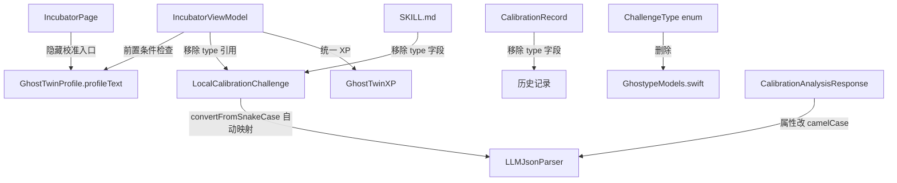

# 设计文档：校准系统修正（Calibration Fix）

## 概述

本设计修正 Ghost Twin 校准系统的三个问题：
1. 添加校准前置条件检查——只有首次 profiling 完成后才向用户提供校准机会
2. 移除无实际意义的 `ChallengeType` 分类，统一 XP 奖励
3. `LLMJsonParser` 全局添加 `convertFromSnakeCase` 策略，所有 Swift Decodable 属性统一 camelCase

关键设计决策：在 `LLMJsonParser` 的 `JSONDecoder` 上全局设置 `.convertFromSnakeCase`。这是 Swift 社区的标准做法（参考 [Hacking with Swift](https://www.hackingwithswift.com/swift/4.1/key-decoding-strategies)、[Nil Coalescing](https://www.nilcoalescing.com/blog/AutoConvertJsonSnakeCaseToSwiftCamelCaseProperties)）。同时将 `CalibrationAnalysisResponse` 中不规范的 snake_case 属性名（`profile_diff`、`ghost_response`、`new_tags`）改为 camelCase（`profileDiff`、`ghostResponse`、`newTags`），使其符合 Swift 命名规范。

## 架构

### 变更范围



### 变更策略

采用 Swift 社区标准做法：
- `LLMJsonParser` 的 `JSONDecoder` 全局设置 `.convertFromSnakeCase`
- 所有 LLM 返回的 Decodable 结构体属性统一使用 camelCase
- `CalibrationAnalysisResponse` 的 `profile_diff`→`profileDiff`、`ghost_response`→`ghostResponse`，`ProfileDiff` 的 `new_tags`→`newTags`
- `LocalCalibrationChallenge` 保持 `targetField`（已经是 camelCase），无需 CodingKeys
- UI 层通过计算属性 `hasCompletedProfiling` 控制校准入口显隐

## 组件与接口

### 1. IncubatorViewModel 变更

```swift
// 新增计算属性
var hasCompletedProfiling: Bool {
    !profile.profileText.trimmingCharacters(in: .whitespacesAndNewlines).isEmpty
}

// startCalibration() 添加防御性检查
func startCalibration() async {
    guard !isLoadingChallenge else { return }
    guard hasCompletedProfiling else {
        FileLogger.log("[IncubatorViewModel] startCalibration blocked: profiling not completed")
        return
    }
    // ... 现有逻辑
}

// submitAnswer() 中 XP 计算改为统一值
let xpReward = GhostTwinXP.calibrationXPReward  // 统一 300 XP
```

### 2. IncubatorPage UI 变更

```swift
// rpgDialogLayer 中校准提示的条件增加 profiling 检查
} else if viewModel.hasCompletedProfiling 
    && viewModel.challengesRemaining > 0 
    && !viewModel.showReceiptSlip {
    // 校准提示
    RPGDialogView(...)
}
```

### 3. LocalCalibrationChallenge 变更

```swift
struct LocalCalibrationChallenge: Codable, Equatable {
    let scenario: String
    let options: [String]
    let targetField: String   // "form" | "spirit" | "method"
    // 无需 CodingKeys，convertFromSnakeCase 自动映射 target_field → targetField
}
```

### 4. GhostTwinXP 变更

```swift
enum GhostTwinXP {
    // 移除 xpReward(for:) 方法
    // 新增统一校准 XP 奖励常量
    static let calibrationXPReward = 300
}
```

### 5. CalibrationRecord 变更

```swift
struct CalibrationRecord: Codable, Identifiable, Equatable {
    let id: UUID
    // 移除 type 字段
    let scenario: String
    let options: [String]
    let selectedOption: Int
    let customAnswer: String?
    let xpEarned: Int
    let ghostResponse: String
    let profileDiff: String?
    let createdAt: Date
}
```

### 6. ChallengeType 枚举删除

从 `GhostypeModels.swift` 中删除 `ChallengeType` 枚举。所有引用该枚举的代码需要同步清理。

### 7. SKILL.md 变更

出题模式输出格式改为：
```json
{"target_field": "form|spirit|method", "scenario": "...", "options": ["A", "B", "C"]}
```
不再包含 `type` 字段。

### 8. MessageBuilder 变更

`buildAnalysisUserMessage` 中移除 `challenge.type.rawValue` 引用，改为不输出类型信息（因为类型已移除）。

`buildChallengeUserMessage` 和 `buildProfilingUserMessage` 中 `CalibrationRecord` 的 `type` 引用也需要移除。

### 9. LLMJsonParser 变更

```swift
static func parse<T: Decodable>(_ raw: String) throws -> T {
    let cleaned = stripMarkdownCodeBlock(raw)
    guard let data = cleaned.data(using: .utf8) else {
        throw LLMParseError.invalidEncoding(preview: String(raw.prefix(100)))
    }
    do {
        let decoder = JSONDecoder()
        decoder.keyDecodingStrategy = .convertFromSnakeCase  // 新增
        return try decoder.decode(T.self, from: data)
    } catch {
        throw LLMParseError.invalidJSON(
            preview: String(raw.prefix(200)),
            underlying: error
        )
    }
}
```

### 10. CalibrationAnalysisResponse 变更

属性名从 snake_case 改为 Swift 标准 camelCase：

```swift
struct CalibrationAnalysisResponse: Decodable {
    let profileDiff: ProfileDiff      // 原 profile_diff
    let ghostResponse: String         // 原 ghost_response
    let analysis: String

    struct ProfileDiff: Codable {
        let layer: String
        let changes: [String: String]
        let newTags: [String]         // 原 new_tags
    }
}
```

所有引用这些属性的代码需要同步更新（如 `analysis.profile_diff` → `analysis.profileDiff`）。

## 数据模型

### LocalCalibrationChallenge（修改后）

| 字段 | 类型 | JSON 键 | 说明 |
|------|------|---------|------|
| scenario | String | scenario | 场景描述 |
| options | [String] | options | 选项列表 |
| targetField | String | target_field | 目标层级：form/spirit/method |

### CalibrationRecord（修改后）

| 字段 | 类型 | 说明 |
|------|------|------|
| id | UUID | 唯一标识 |
| scenario | String | 场景描述 |
| options | [String] | 选项列表 |
| selectedOption | Int | 用户选择的选项索引，-1 表示自定义 |
| customAnswer | String? | 自定义答案文本 |
| xpEarned | Int | 获得的 XP |
| ghostResponse | String | Ghost 反馈语 |
| profileDiff | String? | LLM 返回的 diff 原始文本 |
| createdAt | Date | 创建时间 |

### CalibrationAnalysisResponse（修改后）

属性名从 snake_case 改为 camelCase，由 `LLMJsonParser` 的 `convertFromSnakeCase` 自动映射：

| 字段 | 类型 | JSON 键 | 说明 |
|------|------|---------|------|
| profileDiff | ProfileDiff | profile_diff | 档案增量更新 |
| ghostResponse | String | ghost_response | Ghost 反馈语 |
| analysis | String | analysis | 分析文本 |

ProfileDiff 嵌套结构：

| 字段 | 类型 | JSON 键 | 说明 |
|------|------|---------|------|
| layer | String | layer | 层级 |
| changes | [String: String] | changes | 变更内容 |
| newTags | [String] | new_tags | 新标签 |

### 向后兼容性

已安装用户的本地 `calibration_records.json` 包含 `type` 字段。移除 `type` 后：
- `JSONDecoder` 默认忽略 JSON 中多余的字段，所以旧数据文件可以正常加载（`type` 字段会被忽略）
- 新记录不再包含 `type` 字段
- 无需数据迁移


## 正确性属性

*正确性属性是一种在系统所有有效执行中都应成立的特征或行为——本质上是关于系统应该做什么的形式化陈述。属性是人类可读规范与机器可验证正确性保证之间的桥梁。*

Property 1: hasCompletedProfiling 对空/非空 profileText 的正确性

*For any* 字符串 s，如果 s 为空或仅包含空白字符，则 hasCompletedProfiling 应返回 false；如果 s 包含至少一个非空白字符，则应返回 true。

**Validates: Requirements 1.1**

Property 2: LocalCalibrationChallenge 解析一致性

*For any* 有效的 LLM 返回 JSON（包含 snake_case 字段 target_field、scenario、options），通过配置了 convertFromSnakeCase 的 JSONDecoder 解析为 LocalCalibrationChallenge 应成功，且 targetField、scenario、options 字段值正确。

**Validates: Requirements 4.4, 4.5**

Property 3: CalibrationRecord 往返一致性

*For any* 有效的 CalibrationRecord 实例（不含 type 字段，包含任意 scenario、options、selectedOption、xpEarned、ghostResponse、createdAt），编码为 JSON 再解码应产生等价的对象。

**Validates: Requirements 2.3**

Property 4: CalibrationAnalysisResponse 解析正确性

*For any* 有效的 CalibrationAnalysisResponse JSON（包含 snake_case 字段 profile_diff、ghost_response、analysis），通过 LLMJsonParser（已配置 convertFromSnakeCase）解析应成功，且 profileDiff、ghostResponse、analysis 字段值正确。嵌套的 ProfileDiff 中 new_tags 应正确映射到 newTags。

**Validates: Requirements 4.3**

## 错误处理

| 场景 | 处理方式 |
|------|----------|
| profileText 为空时调用 startCalibration | 静默拒绝，记录日志，不显示错误给用户 |
| LLM 返回的 JSON 缺少 target_field | LLMJsonParser 抛出 invalidJSON 错误，IncubatorViewModel 捕获并显示错误信息 |
| 旧版 calibration_records.json 包含 type 字段 | JSONDecoder 自动忽略多余字段，正常加载 |
| LLM 返回的 JSON 包含意外的 type 字段 | JSONDecoder 自动忽略多余字段，正常解析 |

## 测试策略

### 属性测试（Property-Based Testing）

使用 Swift 内置的 XCTest 框架，手动生成随机输入进行属性测试（项目现有模式）。每个属性测试至少运行 100 次迭代。

每个属性测试需要用注释标注对应的设计属性：
- 格式：`Feature: calibration-fix, Property {number}: {property_text}`

属性测试任务：
1. **Property 1**: 生成随机字符串（空、纯空白、含非空白字符），验证 hasCompletedProfiling 逻辑
2. **Property 2**: 生成随机 snake_case JSON，通过配置了 convertFromSnakeCase 的 JSONDecoder 解析为 LocalCalibrationChallenge 验证
3. **Property 3**: 生成随机 CalibrationRecord 实例（无 type），编码/解码往返验证
4. **Property 4**: 生成随机 CalibrationAnalysisResponse snake_case JSON，通过 LLMJsonParser 解析验证 camelCase 属性映射正确

### 单元测试

单元测试覆盖具体示例和边界情况：
- startCalibration 在 profileText 为空时被拒绝
- SKILL.md 输出格式不包含 type 字段
- 统一 XP 奖励值为 300
- 旧版 CalibrationRecord JSON（含 type）能正常加载

### 测试文件

测试代码放在 `AIInputMethod/Tests/` 目录下，遵循项目现有的测试模式（test target 无法 import executable target，需要创建 test-local model copies）。
