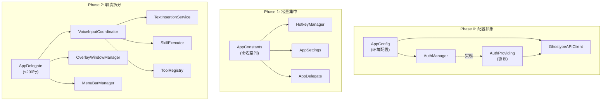
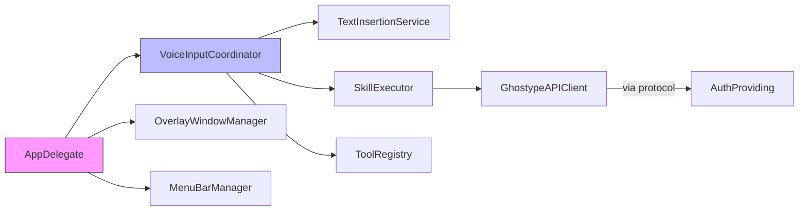

# 设计文档：GHOSTYPE 解耦重构

## 概述

本设计将 GHOSTYPE 代码库按照重构指南的优先级（P0→P1→P2→P3→P4）分阶段解耦。核心策略是：

1. **Phase 0（P0）**：提取配置抽象层 `AppConfig`，收敛 `#if DEBUG` 分支；为 `GhostypeAPIClient` 引入 `AuthProviding` 协议解耦认证依赖
2. **Phase 1（P1）**：将所有魔法数字集中到 `AppConstants` 命名空间
3. **Phase 2（P2）**：为 7 个单例定义 Protocol；将 AppDelegate 拆分为 4 个协调器；消除循环依赖
4. **Phase 3（P4）**：将语音输入状态收敛到 `VoiceInputCoordinator`

每个 Phase 独立可部署，重构后行为与原逻辑完全等效。

## 架构

### 分阶段架构演进



### 依赖方向（Phase 2 后）



所有依赖单向流动，无循环引用。

## 组件与接口

### Phase 0：配置抽象层

#### AppConfig

```swift
// 文件: Sources/Features/Settings/AppConfig.swift
enum AppConfig {
    /// API base URL（统一配置源）
    static var apiBaseURL: String {
        #if DEBUG
        return "http://localhost:3000"
        #else
        return "https://www.ghostype.one"
        #endif
    }
    
    /// 认证回调 URL scheme
    static let authScheme = "ghostype"
    static let authHost = "auth"
    
    /// 登录页路径
    static var signInURL: String {
        let redirect = "/auth/callback?scheme=\(authScheme)://\(authHost)"
        let encoded = redirect.addingPercentEncoding(withAllowedCharacters: .urlQueryAllowed) ?? redirect
        return "\(apiBaseURL)/sign-in?redirect_url=\(encoded)"
    }
    
    static var signUpURL: String {
        let redirect = "/auth/callback?scheme=\(authScheme)://\(authHost)"
        let encoded = redirect.addingPercentEncoding(withAllowedCharacters: .urlQueryAllowed) ?? redirect
        return "\(apiBaseURL)/sign-up?redirect_url=\(encoded)"
    }
}
```

#### AuthProviding 协议

```swift
// 文件: Sources/Features/Auth/AuthProviding.swift
protocol AuthProviding: AnyObject {
    var isLoggedIn: Bool { get }
    func getToken() -> String?
    func handleUnauthorized()
}

// AuthManager 实现该协议（无需修改现有逻辑，仅添加 conformance）
extension AuthManager: AuthProviding {}
```

#### GhostypeAPIClient 改造

```swift
// 改造后的 GhostypeAPIClient
class GhostypeAPIClient {
    static let shared = GhostypeAPIClient()
    
    private let auth: AuthProviding
    
    /// 生产用初始化（保持向后兼容）
    private init() {
        self.auth = AuthManager.shared
    }
    
    /// 测试用初始化
    init(auth: AuthProviding) {
        self.auth = auth
    }
    
    var apiBaseURL: String { AppConfig.apiBaseURL }
    
    func buildRequest(url: URL, method: String, timeout: TimeInterval) throws -> URLRequest {
        guard let token = auth.getToken() else {
            throw GhostypeError.unauthorized(L.Auth.loginRequired)
        }
        // ... 其余不变
    }
}
```

### Phase 1：常量集中

```swift
// 文件: Sources/Features/Settings/AppConstants.swift
enum AppConstants {
    // MARK: - AI 处理
    enum AI {
        static let defaultPolishThreshold = 20
        static let llmTimeout: TimeInterval = 30
        static let profileTimeout: TimeInterval = 10
    }
    
    // MARK: - 快捷键
    enum Hotkey {
        static let modifierDebounceMs: Double = 300
        static let permissionRetryInterval: TimeInterval = 2
    }
    
    // MARK: - Overlay 动画
    enum Overlay {
        static let commitDismissDelay: TimeInterval = 0.2
        static let memoDismissDelay: TimeInterval = 1.8
        static let speechTimeoutSeconds: TimeInterval = 3.0
        static let loginRequiredDismissDelay: TimeInterval = 2.0
    }
    
    // MARK: - 文本插入
    enum TextInsertion {
        static let clipboardPasteDelay: TimeInterval = 1.0
        static let keyUpDelay: TimeInterval = 0.05
        static let autoEnterDelay: TimeInterval = 0.2
    }
    
    // MARK: - 窗口尺寸
    enum Window {
        static let onboardingSize = NSSize(width: 480, height: 520)
        static let dashboardMinSize = NSSize(width: 900, height: 600)
        static let dashboardDefaultSize = NSSize(width: 1000, height: 700)
        static let testWindowSize = NSSize(width: 400, height: 480)
    }
}
```

### Phase 2：AppDelegate 拆分

#### VoiceInputCoordinator

```swift
// 文件: Sources/Features/VoiceInput/VoiceInputCoordinator.swift
class VoiceInputCoordinator: ObservableObject {
    // 依赖注入
    private let speechService: DoubaoSpeechService
    private let skillExecutor: SkillExecutor
    private let toolRegistry: ToolRegistry
    private let textInserter: TextInsertionService
    private let overlayManager: OverlayWindowManager
    
    // 状态（从 AppDelegate 迁移）
    @Published var currentSkill: SkillModel? = nil
    @Published var isVoiceInputEnabled: Bool = false
    private var currentRawText: String = ""
    private var pendingSkill: SkillModel?
    private var waitingForFinalResult = false
    
    init(speechService: DoubaoSpeechService,
         skillExecutor: SkillExecutor,
         toolRegistry: ToolRegistry,
         textInserter: TextInsertionService,
         overlayManager: OverlayWindowManager) {
        self.speechService = speechService
        self.skillExecutor = skillExecutor
        self.toolRegistry = toolRegistry
        self.textInserter = textInserter
        self.overlayManager = overlayManager
    }
    
    // processWithSkill、processWithMode、processPolish 等方法从 AppDelegate 迁移至此
    // 逻辑完全等效，仅将 self.insertTextAtCursor 替换为 textInserter.insert
    // 将 self.hideOverlay 替换为 overlayManager.hide
}
```

#### OverlayWindowManager

```swift
// 文件: Sources/Features/VoiceInput/OverlayWindowManager.swift
class OverlayWindowManager {
    private var overlayWindow: NSPanel!
    
    func setup(speechService: DoubaoSpeechService)
    func show()
    func hide()
    func positionAtBottom()
    func moveTo(bounds: CGRect)
}
```

#### MenuBarManager

```swift
// 文件: Sources/Features/MenuBar/MenuBarManager.swift
class MenuBarManager {
    private var statusItem: NSStatusItem!
    
    func setup(permissionManager: PermissionManager,
               onShowDashboard: @escaping () -> Void,
               onCheckUpdate: @escaping () -> Void)
}
```

#### TextInsertionService

```swift
// 文件: Sources/Features/VoiceInput/TextInsertionService.swift
class TextInsertionService {
    func insert(_ text: String)
    func saveUsageRecord(content: String, category: RecordCategory)
}
```

### Phase 2：单例协议抽象

```swift
// Sources/Features/Settings/AppSettingsProviding.swift
protocol AppSettingsProviding {
    var enableAIPolish: Bool { get }
    var polishThreshold: Int { get }
    var translateLanguage: TranslateLanguage { get }
    var enableInSentencePatterns: Bool { get }
    var enableTriggerCommands: Bool { get }
    var triggerWord: String { get }
    var enableContactsHotwords: Bool { get }
    func shouldAutoEnter(for bundleId: String?) -> Bool
    func sendMethod(for bundleId: String?) -> SendMethod
}
extension AppSettings: AppSettingsProviding {}

// Sources/Features/Dashboard/QuotaProviding.swift
protocol QuotaProviding {
    var usedPercentage: Double { get }
    var formattedUsed: String { get }
    func refresh() async
    func reportAndRefresh(characters: Int) async
}
extension QuotaManager: QuotaProviding {}

// Sources/Features/AI/Skill/SkillProviding.swift
protocol SkillProviding {
    var skills: [SkillModel] { get }
    func loadAllSkills()
    func skillForKeyCode(_ keyCode: UInt16) -> SkillModel?
    func ensureBuiltinSkills()
}
extension SkillManager: SkillProviding {}

// Sources/Features/Dashboard/OverlayStateProviding.swift
protocol OverlayStateProviding {
    func setRecording(skill: SkillModel?)
    func setProcessing(skill: SkillModel?)
    func setCommitting(type: CommitType)
    func setLoginRequired()
}
extension OverlayStateManager: OverlayStateProviding {}
```

### Phase 2：循环依赖消除

当前循环：`AppDelegate → ToolRegistry.registerBuiltins(provideText: { self.insertTextAtCursor... })`

改造后：
- `ToolRegistry.registerBuiltins` 接受协议回调而非闭包捕获 AppDelegate
- `VoiceInputCoordinator` 在初始化时注册 Tool 回调，ToolRegistry 和 SkillExecutor 不持有对 Coordinator 的引用

```swift
// ToolRegistry 改造：使用协议代替闭包
protocol ToolOutputHandler: AnyObject {
    func handleTextOutput(context: ToolContext)
    func handleMemoSave(text: String)
}

class ToolRegistry {
    private var handlers: [String: ToolHandler] = [:]
    weak var outputHandler: ToolOutputHandler?
    
    func registerBuiltins() {
        register(name: "provide_text") { [weak self] context in
            self?.outputHandler?.handleTextOutput(context: context)
        }
        register(name: "save_memo") { [weak self] context in
            self?.outputHandler?.handleMemoSave(text: context.text)
        }
    }
}

// VoiceInputCoordinator 实现 ToolOutputHandler
extension VoiceInputCoordinator: ToolOutputHandler {
    func handleTextOutput(context: ToolContext) { /* ... */ }
    func handleMemoSave(text: String) { /* ... */ }
}
```

## 数据模型

本次重构不引入新的数据模型。主要变更是：

1. **AppConfig**（enum，无实例状态）：纯静态属性，存储环境配置
2. **AppConstants**（enum，无实例状态）：纯静态常量，存储魔法数字
3. **协议定义**：`AuthProviding`、`AppSettingsProviding`、`QuotaProviding`、`SkillProviding`、`OverlayStateProviding`、`ToolOutputHandler` — 均为接口定义，无数据存储

现有数据模型（`SkillModel`、`ToolContext`、`ToolCallResult`、`UsageRecord`、`ProfileResponse` 等）保持不变。


## 正确性属性

*属性（Property）是一种在系统所有合法执行路径上都应成立的特征或行为——本质上是对系统应做之事的形式化陈述。属性是人类可读规格说明与机器可验证正确性保证之间的桥梁。*

### Property 1：配置值自洽性

*For any* 配置项（apiBaseURL、signInURL、signUpURL），signInURL 和 signUpURL 应以 apiBaseURL 为前缀，且所有 URL 值非空。

**Validates: Requirements 1.1, 8.1**

### Property 2：请求构建正确性

*For any* 非空 token 字符串，通过注入返回该 token 的 AuthProviding mock 构建的 URLRequest，其 Authorization header 应等于 `"Bearer {token}"`，且请求 URL 应以 `AppConfig.apiBaseURL` 为前缀。

**Validates: Requirements 1.4, 2.1, 8.2**

### Property 3：parseToolCall 稳定性

*For any* 包含 `{"tool": "<name>", "content": "<text>"}` 结构的 JSON 字符串，`SkillExecutor.parseToolCall` 应正确提取 tool 名称和 content 内容；对于不包含该结构的任意字符串，应返回 nil。

**Validates: Requirements 8.4**

### Property 4：短文本直通

*For any* 长度小于润色阈值的非空文本，当 AI 润色开启时，VoiceInputCoordinator 应直接返回原始文本而非调用 AI API。

**Validates: Requirements 8.6**

### Property 5：错误回退

*For any* Skill 执行过程中的 API 错误（directOutput 或 rewrite 行为），VoiceInputCoordinator 应回退到原始语音文本。

**Validates: Requirements 5.9**

### Property 6：Skill 路由等效性

*For any* SkillModel 和语音文本组合，VoiceInputCoordinator 的路由决策（memo 直接保存、nil skill 走默认润色、其他 skill 走 SkillExecutor）应与原 AppDelegate.processWithSkill 的路由逻辑完全一致。

**Validates: Requirements 5.7**

## 错误处理

| 场景 | 处理方式 | 来源需求 |
|------|---------|---------|
| AuthProviding.getToken() 返回 nil | GhostypeAPIClient.buildRequest 抛出 `GhostypeError.unauthorized` | 8.3 |
| API 返回 401 | 调用 AuthProviding.handleUnauthorized()，抛出 unauthorized 错误 | 2.2 |
| API 返回 500/502 | 自动重试一次，仍失败则抛出 serverError（现有逻辑不变） | — |
| SkillExecutor API 调用失败 | directOutput/rewrite 行为回退原文；explain/noInput 行为通知错误回调 | 5.9 |
| ToolRegistry 执行未知 Tool | 抛出 `ToolError.unknownTool`，SkillExecutor 回退到默认分发 | 6.3 |
| 语音识别超时（3s） | 使用已有的 currentRawText 继续处理（现有逻辑不变） | — |
| 空文本输入 | 跳过处理，隐藏 Overlay | 8.5 |

## 测试策略

### 测试框架

- **单元测试**：Swift Testing（`@Test`、`#expect`）
- **属性测试**：SwiftCheck（`property`、`forAll`、`Gen`）
- 每个属性测试至少运行 100 次迭代

### 属性测试

每个正确性属性对应一个属性测试，使用 SwiftCheck 的 `forAll` 生成随机输入：

| 属性 | 生成器 | 标签 |
|------|--------|------|
| Property 1 | 无需生成器（静态值验证） | Feature: decoupling-refactor, Property 1: 配置值自洽性 |
| Property 2 | `Gen<String>.alphanumeric` 生成随机 token | Feature: decoupling-refactor, Property 2: 请求构建正确性 |
| Property 3 | `Gen<String>` 生成随机 tool name 和 content，构造 JSON | Feature: decoupling-refactor, Property 3: parseToolCall 稳定性 |
| Property 4 | `Gen<String>` 生成长度 1..<threshold 的随机文本 | Feature: decoupling-refactor, Property 4: 短文本直通 |
| Property 5 | `Gen<GhostypeError>` 生成随机错误类型 | Feature: decoupling-refactor, Property 5: 错误回退 |
| Property 6 | `Gen<(SkillModel?, String)>` 生成随机 skill 和文本组合 | Feature: decoupling-refactor, Property 6: Skill 路由等效性 |

### 单元测试

- **边界情况**：Token 为 nil 时 buildRequest 抛出 unauthorized（需求 8.3）
- **边界情况**：空文本/纯空白文本跳过处理（需求 8.5）
- **示例测试**：ToolRegistry 执行 provide_text 调用协议方法（需求 6.3）
- **示例测试**：ToolRegistry 执行 save_memo 调用协议方法（需求 6.4）
- **示例测试**：常量值正确性验证（需求 3.1, 3.2）
- **示例测试**：AppConfig.signInURL 格式正确（需求 1.2, 1.5）
- **示例测试**：状态变更触发通知（需求 7.2）
