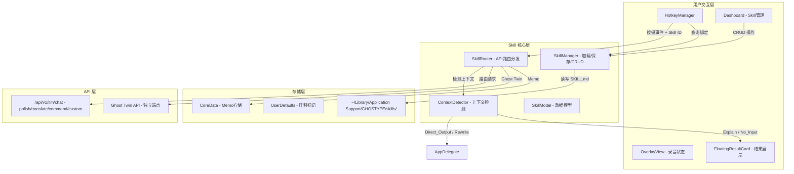
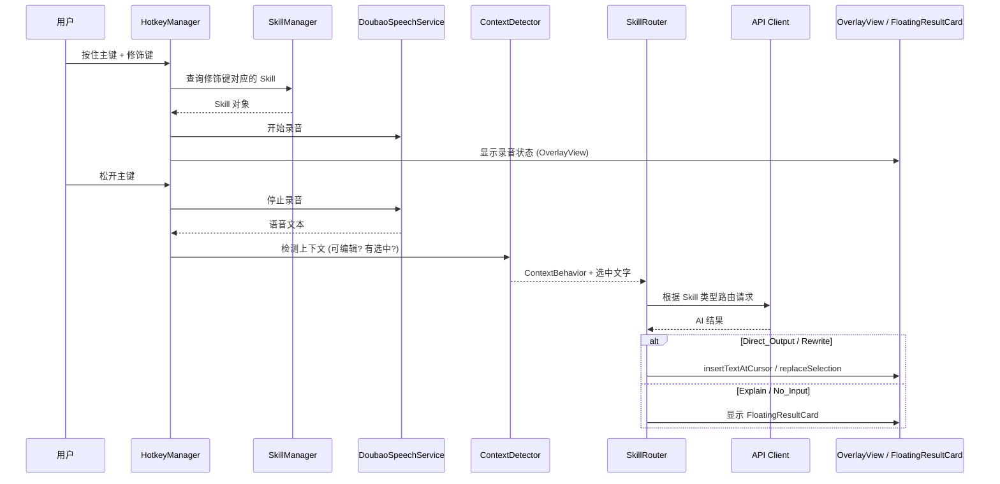

# 设计文档：Ghost Morph

## 概述

Ghost Morph 将 GHOSTYPE 的硬编码 InputMode 枚举替换为动态 Skill 系统。核心变更包括：

1. **Skill 数据模型**：以 SKILL.md（YAML frontmatter + markdown body）文件存储，支持内置和自定义 Skill
2. **修饰键绑定**：从固定的 `AppSettings.modeFromModifiers()` 迁移到动态的 Skill 按键映射
3. **上下文行为检测**：新增 Context_Detector，根据光标/选中状态分发四种行为
4. **悬浮结果卡片**：新 UI 组件，用于不可输入场景下展示 AI 输出
5. **Skill 路由**：替代 `processWithMode()` 的 switch-case，根据 Skill 类型路由到不同 API
6. **Dashboard Skill 管理**：新增 Skill 管理页面

设计目标是最小化对现有代码的破坏，保持润色（polish）作为默认行为不变，通过渐进式替换完成迁移。

## 架构

### 整体架构图



### 数据流



## 组件与接口

### 1. SkillModel（数据模型）

文件位置：`Sources/Features/AI/Skill/SkillModel.swift`

```swift
struct SkillModel: Identifiable, Codable, Equatable {
    let id: String                          // UUID 字符串
    var name: String                        // 显示名称
    var description: String                 // 功能描述
    var icon: String                        // SF Symbol 名称
    var modifierKey: ModifierKeyBinding?    // 绑定的按键（nil = 未绑定）
    var promptTemplate: String              // prompt 模板（markdown body）
    var behaviorConfig: [String: String]    // 行为配置字典
    var isBuiltin: Bool                     // 是否内置
    var isEditable: Bool                    // prompt 是否可编辑
    var skillType: SkillType               // Skill 类型，决定路由
}

enum SkillType: String, Codable {
    case polish         // 默认润色（无修饰键时）
    case memo           // 随心记
    case translate      // 翻译
    case ghostCommand   // Ghost Command
    case ghostTwin      // Call Ghost Twin
    case custom         // 用户自定义
}

struct ModifierKeyBinding: Codable, Equatable {
    let keyCode: UInt16             // 按键 keyCode
    let isSystemModifier: Bool      // 是否为系统修饰键 (Shift/Cmd/Ctrl/Fn)
    let displayName: String         // 显示名称 (如 "⇧", "⌘", "A")
}
```

### 2. SKILL.md 解析器

文件位置：`Sources/Features/AI/Skill/SkillFileParser.swift`

SKILL.md 文件格式示例：

```markdown
---
id: "builtin-memo"
name: "随心记"
description: "将语音直接记录为笔记"
icon: "note.text"
modifier_key_code: 56
modifier_key_is_system: true
modifier_key_display: "⇧"
skill_type: "memo"
is_builtin: true
is_editable: false
behavior_config:
  polish_before_save: "false"
---

# 随心记

将用户的语音输入直接保存到笔记本。支持配置是否先润色再保存。
```

```swift
struct SkillFileParser {
    /// 解析 SKILL.md 文件内容为 SkillModel
    static func parse(_ content: String) throws -> SkillModel

    /// 将 SkillModel 序列化为 SKILL.md 文件内容
    static func print(_ skill: SkillModel) -> String
}
```

### 3. SkillManager（管理器）

文件位置：`Sources/Features/AI/Skill/SkillManager.swift`

```swift
@Observable
class SkillManager {
    static let shared = SkillManager()

    /// 所有已加载的 Skill（内置 + 自定义）
    private(set) var skills: [SkillModel] = []

    /// 按键绑定映射 [keyCode: SkillModel.id]
    private(set) var keyBindings: [UInt16: String] = [:]

    /// 存储目录
    let storageDirectory: URL  // ~/Library/Application Support/GHOSTYPE/skills/

    // CRUD 操作
    func loadAllSkills()
    func createSkill(_ skill: SkillModel) throws
    func updateSkill(_ skill: SkillModel) throws
    func deleteSkill(id: String) throws
    func skillForKeyCode(_ keyCode: UInt16) -> SkillModel?
    func rebindKey(skillId: String, newBinding: ModifierKeyBinding?) throws
    func hasKeyConflict(_ binding: ModifierKeyBinding, excludingSkillId: String?) -> SkillModel?

    // 初始化内置 Skill
    func ensureBuiltinSkills()
}
```

### 4. ContextDetector（上下文检测器）

文件位置：`Sources/Features/Accessibility/ContextDetector.swift`

```swift
enum ContextBehavior {
    case directOutput                       // 可输入 + 无选中
    case rewrite(selectedText: String)      // 可输入 + 有选中
    case explain(selectedText: String)      // 不可输入 + 有选中
    case noInput                            // 不可输入 + 无选中
}

class ContextDetector {
    /// 利用现有的 FocusObserver 和 Accessibility API 检测当前上下文
    func detect() -> ContextBehavior
}
```

检测逻辑：
1. 通过 `AXUIElementCreateSystemWide()` 获取当前焦点元素
2. 通过 `kAXValueAttribute` + `AXUIElementIsAttributeSettable` 判断是否可编辑（复用 FocusObserver 的逻辑）
3. 通过 `kAXSelectedTextAttribute` 获取选中文字
4. 组合两个维度返回 `ContextBehavior`

### 5. SkillRouter（路由器）

文件位置：`Sources/Features/AI/Skill/SkillRouter.swift`

```swift
class SkillRouter {
    let apiClient: GhostypeAPIClient
    let contextDetector: ContextDetector

    /// 执行 Skill：检测上下文 → 调用 API → 分发结果
    func execute(
        skill: SkillModel,
        speechText: String,
        onDirectOutput: (String) -> Void,
        onRewrite: (String) -> Void,
        onFloatingCard: (String, String, SkillModel) -> Void,
        onError: (Error, ContextBehavior) -> Void
    ) async
}
```

路由规则：
| SkillType | API 端点 | 备注 |
|-----------|---------|------|
| polish | /api/v1/llm/chat (mode="polish") | 保持现有逻辑 |
| translate | /api/v1/llm/chat (mode="translate") | 附带 translate_language |
| ghostCommand | /api/v1/llm/chat | 使用固定 prompt |
| ghostTwin | 独立 Ghost Twin 端点 | 使用人格档案 |
| memo | 本地 CoreData | 不调用 API |
| custom | /api/v1/llm/chat | 使用 SKILL.md 中的 prompt_template |

### 6. FloatingResultCard（悬浮结果卡片）

文件位置：`Sources/UI/FloatingResultCard.swift`

```swift
struct FloatingResultCardView: View {
    let skillIcon: String
    let skillName: String
    let userSpeechText: String
    let aiResult: String
    var onCopy: () -> Void
    var onShare: () -> Void
    var onDismiss: () -> Void
}

class FloatingResultCardController {
    static let shared = FloatingResultCardController()

    func show(skill: SkillModel, speechText: String, result: String, near: CGPoint?)
    func dismiss()
}
```

UI 规格：
- 毛玻璃背景（NSVisualEffectView，material: .hudWindow）
- 圆角卡片，宽度 320pt，高度自适应
- 顶部：Skill 图标 + 名称
- 中部：用户语音原文（灰色小字）+ AI 结果（白色正文）
- 底部：复制按钮 + 分享按钮
- 点击外部或 Escape 关闭
- 使用 NSPanel（nonactivatingPanel）实现，不抢焦点

### 7. HotkeyManager 改造

现有 `getModeFromModifiers()` 返回 `InputMode`，需要改为返回 `SkillModel?`：

```swift
// 现有逻辑（将被替换）
private func getModeFromModifiers(_ modifiers: NSEvent.ModifierFlags) -> InputMode {
    var extraModifiers = modifiers
    extraModifiers.remove(targetModifiers)
    return AppSettings.shared.modeFromModifiers(extraModifiers)
}

// 新逻辑
private func getSkillFromEvent(keyCode: UInt16?, modifiers: NSEvent.ModifierFlags) -> SkillModel? {
    // 1. 检查是否有普通按键按下（非修饰键）
    if let keyCode = keyCode {
        return SkillManager.shared.skillForKeyCode(keyCode)
    }
    // 2. 检查系统修饰键
    let extraModifiers = modifiers.subtracting(targetModifiers)
    // 遍历 SkillManager 的绑定，匹配修饰键
    return SkillManager.shared.skillForModifiers(extraModifiers)
}
```

回调签名变更：
- `onHotkeyUp: ((InputMode) -> Void)?` → `onHotkeyUp: ((SkillModel?) -> Void)?`
- `onModeChanged: ((InputMode) -> Void)?` → `onSkillChanged: ((SkillModel?) -> Void)?`

### 8. AppDelegate 改造

`processWithMode()` 将被 `SkillRouter.execute()` 替代：

```swift
// 现有
func processWithMode(_ mode: InputMode) { ... }

// 新增
func processWithSkill(_ skill: SkillModel?, speechText: String) {
    guard let skill = skill else {
        // nil = 默认润色
        processPolish(speechText)
        return
    }
    Task {
        await skillRouter.execute(
            skill: skill,
            speechText: speechText,
            onDirectOutput: { [weak self] text in self?.insertTextAtCursor(text) },
            onRewrite: { [weak self] text in self?.replaceSelectedText(text) },
            onFloatingCard: { text, speech, skill in
                FloatingResultCardController.shared.show(skill: skill, speechText: speech, result: text, near: nil)
            },
            onError: { [weak self] error, behavior in
                // Direct/Rewrite: 回退插入原文
                // Explain/NoInput: 卡片显示错误
            }
        )
    }
}
```

### 9. Dashboard Skill 管理页面

文件位置：`Sources/UI/Dashboard/Pages/SkillPage.swift`

- 新增 `NavItem.skills` 导航项，放在 incubator 之后
- SkillPage 展示所有 Skill 卡片网格
- 每张卡片显示：图标、名称、绑定按键、描述
- 内置 Skill 卡片：查看介绍 + 编辑可配置项（翻译语言、Memo 润色开关）
- 自定义 Skill 卡片：完整编辑 + 删除
- "添加 Skill" 按钮打开创建表单
- Ghost Twin 卡片额外显示 "Ghost Twin Lv.{level}"

### 10. 迁移服务

文件位置：`Sources/Features/AI/Skill/SkillMigrationService.swift`

```swift
struct SkillMigrationService {
    static func migrateIfNeeded() {
        // 1. 检查 UserDefaults "skillMigrationCompleted" 标记
        // 2. 读取旧 AppSettings.translateModifier / memoModifier
        // 3. 将旧绑定写入对应 Builtin_Skill 的 SKILL.md
        // 4. 迁移 translateLanguage 到 Translate_Skill 的 behaviorConfig
        // 5. 标记迁移完成
    }
}
```

## 数据模型

### SKILL.md 文件结构

```
~/Library/Application Support/GHOSTYPE/skills/
├── builtin-memo/
│   └── SKILL.md
├── builtin-ghost-command/
│   └── SKILL.md
├── builtin-ghost-twin/
│   └── SKILL.md
├── builtin-translate/
│   └── SKILL.md
└── {user-custom-uuid}/
    └── SKILL.md
```

### YAML Frontmatter Schema

| 字段 | 类型 | 必填 | 说明 |
|------|------|------|------|
| id | String | ✅ | UUID 或 builtin-xxx |
| name | String | ✅ | 显示名称 |
| description | String | ✅ | 功能描述 |
| icon | String | ✅ | SF Symbol 名称 |
| modifier_key_code | Int | ❌ | 绑定按键的 keyCode |
| modifier_key_is_system | Bool | ❌ | 是否系统修饰键 |
| modifier_key_display | String | ❌ | 按键显示名称 |
| skill_type | String | ✅ | SkillType 枚举值 |
| is_builtin | Bool | ✅ | 是否内置 |
| is_editable | Bool | ✅ | prompt 是否可编辑 |
| behavior_config | Map | ❌ | 行为配置键值对 |

### ContextBehavior 决策矩阵

| 可编辑 | 有选中文字 | 行为 | 输出方式 |
|--------|-----------|------|---------|
| ✅ | ❌ | Direct_Output | insertTextAtCursor |
| ✅ | ✅ | Rewrite | replaceSelectedText |
| ❌ | ✅ | Explain | FloatingResultCard |
| ❌ | ❌ | No_Input | FloatingResultCard |

</text>
</invoke>


## 正确性属性

*正确性属性是一种在系统所有合法执行中都应成立的特征或行为——本质上是关于系统应该做什么的形式化陈述。属性是人类可读规格说明与机器可验证正确性保证之间的桥梁。*

### Property 1: SKILL.md 解析 round-trip

*For any* 合法的 SkillModel 对象，将其通过 SkillFileParser.print() 序列化为 SKILL.md 内容，再通过 SkillFileParser.parse() 解析回 SkillModel，所得对象 SHALL 与原始对象等价。

**Validates: Requirements 1.5, 1.3, 1.4**

### Property 2: Skill 加载完整性

*For any* Skill_Storage_Directory 包含 N 个合法的 SKILL.md 子文件夹，调用 SkillManager.loadAllSkills() 后返回的 Skill 数组长度 SHALL 等于 N，且每个 Skill 的 id 与对应文件夹中的 SKILL.md 内容一致。

**Validates: Requirements 1.6**

### Property 3: 按键绑定查找正确性

*For any* SkillModel 集合，其中每个 Skill 绑定了不同的 ModifierKeyBinding（包括系统修饰键和普通按键），通过 keyCode 查询 SkillManager.skillForKeyCode() SHALL 返回正确绑定的 Skill。

**Validates: Requirements 2.1, 2.2**

### Property 4: 按键冲突检测

*For any* 两个不同的 SkillModel，如果将它们绑定到相同的 keyCode，调用 SkillManager.hasKeyConflict() SHALL 返回已占用该按键的 Skill。

**Validates: Requirements 2.3**

### Property 5: 按键重绑定持久化

*For any* SkillModel 和任意合法的 ModifierKeyBinding，调用 rebindKey() 后重新从磁盘加载该 Skill，其 modifierKey SHALL 与新绑定一致。

**Validates: Requirements 2.4**

### Property 6: 上下文行为路由正确性

*For any* SkillModel 和任意 ContextBehavior（directOutput / rewrite / explain / noInput），SkillRouter SHALL 将结果分发到与该 ContextBehavior 对应的处理器：directOutput 和 rewrite 调用文字插入/替换回调，explain 和 noInput 调用悬浮卡片回调。

**Validates: Requirements 3.2, 3.3, 3.4, 3.5**

### Property 7: 悬浮卡片数据完整性

*For any* SkillModel 和任意语音文本及 AI 结果，FloatingResultCard 的展示数据 SHALL 包含 Skill 图标、Skill 名称、用户语音原文和 AI 处理结果四个字段，且均非空。

**Validates: Requirements 4.2, 7.2**

### Property 8: Skill CRUD 持久化一致性

*For any* 合法的 SkillModel，通过 SkillManager.createSkill() 创建后再通过 loadAllSkills() 重新加载，加载结果 SHALL 包含该 Skill 且所有字段一致。对 updateSkill() 同理：更新后重新加载的 Skill SHALL 反映所有修改。

**Validates: Requirements 6.1, 6.2**

### Property 9: Skill 删除清理

*For any* Custom_Skill，调用 SkillManager.deleteSkill() 后，该 Skill 的存储文件夹 SHALL 不存在，且该 Skill 之前绑定的 keyCode SHALL 不再映射到任何 Skill。

**Validates: Requirements 6.3**

### Property 10: 内置 Skill 删除保护

*For any* Builtin_Skill，调用 SkillManager.deleteSkill() SHALL 抛出错误或返回失败，且该 Skill 的存储文件夹和数据 SHALL 保持不变。

**Validates: Requirements 6.5**

### Property 11: Skill 类型路由正确性

*For any* SkillType，SkillRouter SHALL 将请求路由到该类型对应的 API 端点：polish → /api/v1/llm/chat(mode=polish)，translate → /api/v1/llm/chat(mode=translate)，ghostCommand → /api/v1/llm/chat(custom prompt)，ghostTwin → Ghost Twin 独立端点，memo → 本地 CoreData，custom → /api/v1/llm/chat(custom_prompt)。

**Validates: Requirements 8.1, 8.2, 8.3, 8.4, 8.5, 8.6**

### Property 12: 错误处理按上下文分发

*For any* SkillModel 和任意 ContextBehavior，当 API 请求失败时：如果是 directOutput 或 rewrite 行为，SHALL 回退插入原始语音文本；如果是 explain 或 noInput 行为，SHALL 在 FloatingResultCard 中显示错误信息。

**Validates: Requirements 8.7**

### Property 13: 迁移幂等性

*For any* 旧版配置状态，执行 SkillMigrationService.migrateIfNeeded() 两次 SHALL 产生与执行一次完全相同的结果（第二次为 no-op）。

**Validates: Requirements 9.2**

## 错误处理

### API 错误

| 场景 | Direct_Output / Rewrite | Explain / No_Input |
|------|------------------------|-------------------|
| 网络超时 | 插入原始语音文本 | FloatingResultCard 显示超时提示 |
| 401 未授权 | OverlayView 显示登录提示 | OverlayView 显示登录提示 |
| 429 额度超限 | 插入原始语音文本 + 提示 | FloatingResultCard 显示额度提示 |
| 500 服务器错误 | 自动重试一次，仍失败则插入原文 | 自动重试一次，仍失败则显示错误 |

### 文件系统错误

| 场景 | 处理方式 |
|------|---------|
| SKILL.md 解析失败 | 跳过该 Skill，日志记录，不影响其他 Skill 加载 |
| 存储目录无写入权限 | 提示用户检查权限，Skill 管理功能降级为只读 |
| 磁盘空间不足 | 创建/更新 Skill 时提示错误，不丢失已有数据 |

### 迁移错误

| 场景 | 处理方式 |
|------|---------|
| 旧配置格式无法识别 | 使用默认绑定，日志记录 |
| 迁移中途失败 | 不标记为已完成，下次启动重试 |

## 测试策略

### 属性测试（Property-Based Testing）

使用 Swift 的 [swift-testing](https://github.com/apple/swift-testing) 框架配合自定义生成器进行属性测试。

每个属性测试至少运行 100 次迭代，使用随机生成的输入数据。

| Property | 测试描述 | 生成器 |
|----------|---------|--------|
| P1 | SKILL.md round-trip | 随机 SkillModel（随机名称、图标、类型、配置） |
| P2 | Skill 加载完整性 | 随机数量的 SKILL.md 文件写入临时目录 |
| P3 | 按键绑定查找 | 随机 keyCode + 随机 Skill 集合 |
| P4 | 按键冲突检测 | 随机两个 Skill + 相同 keyCode |
| P5 | 按键重绑定持久化 | 随机 Skill + 随机新 keyCode |
| P6 | 上下文行为路由 | 随机 SkillModel + 随机 ContextBehavior |
| P7 | 悬浮卡片数据完整性 | 随机 SkillModel + 随机文本 |
| P8 | CRUD 持久化 | 随机 SkillModel 创建/更新 |
| P9 | 删除清理 | 随机 Custom_Skill |
| P10 | 内置删除保护 | 随机 Builtin_Skill |
| P11 | 类型路由 | 随机 SkillType |
| P12 | 错误处理分发 | 随机 SkillModel + 随机 ContextBehavior + 模拟错误 |
| P13 | 迁移幂等性 | 随机旧配置值 |

每个属性测试必须以注释标注对应的设计属性：
```swift
// Feature: ghost-morph, Property 1: SKILL.md round-trip
```

### 单元测试

单元测试覆盖具体示例和边界情况：

- 四个内置 Skill 的默认配置验证
- 默认修饰键绑定（Shift → Memo, Command → Ghost Command）
- 空语音文本处理
- SKILL.md 格式错误（缺少 frontmatter、缺少必填字段）
- 迁移：旧 translateModifier/memoModifier → 新 Skill 绑定
- FloatingResultCard 定位逻辑（有光标位置 vs 无光标位置）

### 测试不覆盖的范围

以下需求依赖 macOS 系统 API 或 UI 交互，不适合自动化测试：
- Accessibility API 的实际焦点检测（需求 3.1, 3.6）
- FloatingResultCard 的视觉效果和交互（需求 4.1, 4.3, 4.4, 4.6, 4.7）
- Dashboard UI 导航和编辑流程（需求 7.1, 7.3, 7.4, 7.5, 7.6）
