# 设计文档：Ghost Twin 端上迁移

## Overview

将 Ghost Twin 校准系统从服务端完整迁移到客户端（macOS），实现人格档案本地存储、校准逻辑本地驱动、XP/等级本地计算。服务端仅保留 LLM 代理角色（`POST /api/v1/skill/execute`），三个旧端点废弃。

核心设计决策：
- **简化人格档案模型**：人格档案的「形/神/法」三层内容、summary 等均以纯文本字符串（`profileText`）存储，因为该内容仅作为 LLM prompt 注入使用，无需结构化解析。仅 `level`、`totalXP`、`personalityTags` 等需要程序计算的字段保留为结构化字段。
- **JSON 文件持久化**：人格档案、校准记录、ASR 语料、中间状态均以 JSON 文件存储在 `~/Library/Application Support/GHOSTYPE/ghost_twin/`
- **纯函数计算**：XP/等级计算、每日限制判断等为纯函数，易于测试
- **内部技能复用**：校准出题、答案分析、人格构筑均通过 `isInternal = true` 的内部技能调用 `/api/v1/skill/execute`
- **状态机驱动**：校准流程和构筑轮次各用一个状态机管理，中间状态持久化，支持中断恢复
- **非阻塞设计**：构筑（Profiling）失败不阻塞校准（Calibration），两者独立运行
- **最小侵入**：在现有 `IncubatorViewModel`、`ReceiptSlipView`、`SkillModel`、`GhostypeAPIClient` 基础上扩展

## Architecture

```mermaid
graph TB
    subgraph 端上校准完整流程
        User[用户进入孵化室] --> LoadProfile[加载本地 GhostTwinProfile]
        LoadProfile --> CheckDaily[检查今日剩余次数]
        CheckDaily -->|有剩余| StartCalib[发起校准]
        StartCalib --> LoadSkill1[加载 internal-ghost-calibration 技能]
        LoadSkill1 --> BuildMsg1[拼接出题 user message<br/>档案+标签+历史记录]
        BuildMsg1 --> SkillExec1[executeSkill<br/>→ /api/v1/skill/execute]
        SkillExec1 --> ParseChallenge[LLMJsonParser 解析题目]
        ParseChallenge --> ShowUI[展示热敏纸条 UI]
        ShowUI -->|用户选择预设选项| BuildMsg2[拼接分析 user message<br/>档案+挑战+选项索引]
        ShowUI -->|用户自定义输入| BuildMsg2Custom[拼接分析 user message<br/>档案+挑战+自定义文本+标注]
        BuildMsg2 --> SkillExec2[executeSkill<br/>→ /api/v1/skill/execute]
        BuildMsg2Custom --> SkillExec2
        SkillExec2 --> ParseDiff[LLMJsonParser 解析 profile_diff]
        ParseDiff --> MergeProfile[合并 new_tags 到 personalityTags<br/>version+1]
        MergeProfile --> CalcXP[计算 XP + 检查升级]
        CalcXP -->|未升级| SaveRecord[保存校准记录]
        CalcXP -->|升级| LoadSkill2[加载 internal-ghost-profiling 技能]
        LoadSkill2 --> BuildMsg3[拼接构筑 user message<br/>上轮报告+ASR语料+校准记录]
        BuildMsg3 --> SkillExec3[executeSkill<br/>→ /api/v1/skill/execute]
        SkillExec3 --> ParseProfiling[解析构筑结果]
        ParseProfiling --> ReplaceProfile[整体替换 profileText<br/>更新 personalityTags]
        ReplaceProfile --> MarkCorpus[标记已消费语料]
        MarkCorpus --> SaveRecord
        SaveRecord --> ShowResponse[展示 Ghost 反馈语]
    end

    subgraph 启动恢复链路
        AppLaunch[应用启动] --> RecoveryManager[RecoveryManager]
        RecoveryManager --> CheckCalib[检查校准中间状态]
        RecoveryManager --> CheckProf[检查构筑中间状态]
        CheckCalib -->|存在| ResumeCalib[恢复校准流程]
        CheckProf -->|存在| ResumeProf[恢复构筑请求]
    end

    subgraph ASR 语料收集
        VoiceInput[语音输入完成] --> SaveCorpus[存储 ASR 转写文本]
        SaveCorpus --> CorpusStore[本地语料库 JSON]
    end
```



### 文件结构（新增/修改）

```
Sources/Features/Dashboard/
├── GhostTwinProfile.swift          # 新增：简化人格档案模型 + 持久化
├── CalibrationRecord.swift         # 新增：校准记录模型 + 本地存储（最近20条）
├── GhostTwinXP.swift               # 新增：XP/等级计算纯函数
├── ASRCorpusStore.swift            # 新增：ASR 语料收集与管理
├── LLMJsonParser.swift             # 新增：LLM JSON 响应解析工具
├── CalibrationFlowState.swift      # 新增：校准流程状态机 + 中间状态
├── ProfilingFlowState.swift        # 新增：构筑流程状态机 + 中间状态
├── RecoveryManager.swift           # 新增：启动恢复管理器
├── IncubatorViewModel.swift        # 修改：替换服务端 API 为本地逻辑 + user message 构建

Sources/Features/AI/
├── GhostypeAPIClient.swift         # 修改：移除旧 Ghost Twin API 方法
├── GhostypeModels.swift            # 修改：移除旧响应类型
├── Skill/SkillModel.swift          # 修改：新增内部技能 ID 常量
├── Skill/SkillManager.swift        # 修改：注册内部技能定义

Sources/UI/Dashboard/Pages/Incubator/
├── ReceiptSlipView.swift           # 修改：新增自定义输入入口 + 文本框

default_skills/
├── internal-ghost-calibration/SKILL.md  # 新增：校准内部技能定义
├── internal-ghost-profiling/SKILL.md    # 新增：构筑内部技能定义
├── builtin-ghost-twin/SKILL.md          # 修改：从本地档案注入人格数据
```


## Components and Interfaces

### 1. GhostTwinProfile（简化人格档案模型）— 需求 1

**关键设计决策**：人格档案的「形/神/法」三层内容、summary 等均以纯文本字符串 `profileText` 存储。原因：
- 该内容仅作为 LLM prompt 注入使用，不需要程序解析其内部结构
- LLM 构筑输出的格式可能随 prompt 迭代变化，纯文本更灵活
- 仅 `level`、`totalXP`、`personalityTags` 等需要程序计算的字段保留为结构化字段

```swift
struct GhostTwinProfile: Codable, Equatable {
    var version: Int                    // 档案版本号，每次更新 +1
    var level: Int                      // 当前等级 1~10
    var totalXP: Int                    // 总经验值
    var personalityTags: [String]       // 人格特征标签（用于 UI 展示和 prompt）
    var profileText: String             // 人格档案全文（形/神/法三层 + summary，纯文本）
    var createdAt: Date
    var updatedAt: Date

    /// 初始空档案
    static let initial = GhostTwinProfile(
        version: 0, level: 1, totalXP: 0,
        personalityTags: [],
        profileText: "",
        createdAt: Date(), updatedAt: Date()
    )
}
```

持久化：
- 路径：`~/Library/Application Support/GHOSTYPE/ghost_twin/profile.json`
- 使用 `JSONEncoder`/`JSONDecoder`，`dateEncodingStrategy = .iso8601`
- 首次使用时创建 `GhostTwinProfile.initial`

```swift
/// 人格档案持久化管理
class GhostTwinProfileStore {
    private let filePath: URL

    func load() -> GhostTwinProfile       // 文件不存在时返回 .initial
    func save(_ profile: GhostTwinProfile) throws
}
```

### 2. CalibrationRecord（校准记录）— 需求 2, 13

```swift
/// 校准记录
struct CalibrationRecord: Codable, Identifiable, Equatable {
    let id: UUID
    let type: ChallengeType
    let scenario: String
    let options: [String]
    let selectedOption: Int        // -1 表示使用了自定义答案
    let customAnswer: String?      // selectedOption == -1 时有值（需求 13.6, 13.7）
    let xpEarned: Int
    let ghostResponse: String
    let profileDiff: String?       // LLM 返回的 diff 原始文本（用于记录，不做结构化解析）
    let createdAt: Date
}

/// 校准记录本地存储（最近 20 条）
class CalibrationRecordStore {
    private let filePath: URL  // ~/Library/Application Support/GHOSTYPE/ghost_twin/calibration_records.json

    func loadAll() -> [CalibrationRecord]
    func append(_ record: CalibrationRecord)  // 超过 20 条时丢弃最早的
    func todayCount() -> Int                  // UTC 0:00 重置
}
```

### 3. GhostTwinXP（XP 与等级计算）— 需求 3

```swift
/// XP 与等级计算（纯函数）
enum GhostTwinXP {
    static let xpPerLevel = 10_000
    static let maxLevel = 10

    /// 根据总 XP 计算等级 (1~10)
    /// 公式: min(totalXP / 10000 + 1, 10)
    static func calculateLevel(totalXP: Int) -> Int {
        min(totalXP / xpPerLevel + 1, maxLevel)
    }

    /// 当前等级内的 XP
    /// 未满级: totalXP % 10000
    /// 满级: totalXP - 90000
    static func currentLevelXP(totalXP: Int) -> Int {
        let level = calculateLevel(totalXP: totalXP)
        if level >= maxLevel { return totalXP - (maxLevel - 1) * xpPerLevel }
        return totalXP % xpPerLevel
    }

    /// 检查是否升级，返回 (是否升级, 旧等级, 新等级)
    static func checkLevelUp(oldXP: Int, newXP: Int) -> (leveledUp: Bool, oldLevel: Int, newLevel: Int) {
        let old = calculateLevel(totalXP: oldXP)
        let new = calculateLevel(totalXP: newXP)
        return (new > old, old, new)
    }

    /// 挑战类型对应的 XP 奖励
    static func xpReward(for type: ChallengeType) -> Int {
        switch type {
        case .dilemma: return 500
        case .reverseTuring: return 300
        case .prediction: return 200
        }
    }
}
```

### 4. 每日校准限制 — 需求 4

每日限制逻辑内嵌在 `CalibrationRecordStore` 中：

```swift
extension CalibrationRecordStore {
    static let dailyLimit = 3

    /// 今日已完成挑战数（UTC 0:00 重置）
    func todayCount() -> Int {
        var calendar = Calendar(identifier: .gregorian)
        calendar.timeZone = TimeZone(identifier: "UTC")!
        let todayStart = calendar.startOfDay(for: Date())
        return loadAll().filter { $0.createdAt >= todayStart }.count
    }

    /// 今日剩余挑战次数
    func challengesRemainingToday() -> Int {
        max(Self.dailyLimit - todayCount(), 0)
    }
}
```

### 5. 内部技能 Prompt 模板 — 需求 5, 6, 7, 9

**关键设计决策**：所有 Ghost Twin LLM 调用通过内部技能系统实现，复用现有的 `SkillExecutor` → `GhostypeAPIClient.executeSkill()` 管道。

Prompt 分为两部分：
- **静态模板**：写在 SKILL.md 的 system prompt 中，定义 AI 角色和输出格式
- **动态上下文**：在调用时由 `IncubatorViewModel` 拼接到 user message 中（profile 数据、校准记录、ASR 语料等）

这样做的好处：
1. 复用 `SkillExecutor` 管道，不需要新建 `CalibrationPromptBuilder`
2. Prompt 模板可以通过修改 SKILL.md 文件迭代，无需改代码
3. 内部技能与用户技能共享同一套执行基础设施

#### internal-ghost-calibration SKILL.md（出题 + 分析）

该技能支持两个阶段，通过 user message 的内容区分：

**出题阶段** — user message 包含档案数据和去重记录：
```
## 当前用户档案
- 等级: Lv.{level}
- 档案版本: v{version}
- 已捕捉标签: {personalityTags}
- 人格档案全文:
{profileText}

## 最近校准记录（用于去重）
{recentRecords 摘要}

请根据以上信息生成一道校准挑战题。
```

**分析阶段** — user message 包含挑战信息和用户选择：
```
## 当前人格档案
{profileText}

## 本次挑战信息
- 类型: {type}
- 场景: {scenario}
- 选项: {options}
- 目标层级: {targetField}

## 用户选择
- 选项索引: {selectedOption}
- 选项内容: {selectedText}
（或自定义答案时：）
- 输入方式: 用户自定义输入（未从预设选项中选择）
- 自定义答案: {customAnswer}
注意：用户对预设选项均不满意，选择了自行表达。请基于用户的原始表述进行更深入的人格分析。

## 校准历史
{recentRecords}

请分析用户选择并输出 profile_diff。
```

#### internal-ghost-profiling SKILL.md（人格构筑）

system prompt 包含完整的「形神法三位一体」框架（来自 `虚拟人格构筑prompt.md`）。

user message 包含动态数据：
```
## 上一轮构筑报告（记忆）
{previousReport ?? "首次构筑，无历史报告"}

## 当前等级新增 ASR 语料
{未消费的 ASR 转写文本列表}

## 当前等级校准答案
{本等级的校准记录}

## 当前人格档案
- 等级: Lv.{level}
- 已捕捉标签: {personalityTags}
- 档案全文:
{profileText}

请输出完整的「形神法三位一体」分析报告。
报告中对新增/修订/强化的特征使用 [NEW]、[REVISED]、[REINFORCED] 标记。
最后附上 JSON 格式的结构化摘要：
{"summary": "人格画像描述", "refined_tags": ["标签1", "[NEW] 标签2", ...]}
```

#### 调用方式

```swift
// 在 IncubatorViewModel 中
let calibrationSkill = SkillManager.shared.skill(byId: "internal-ghost-calibration")!
let userMessage = buildChallengeUserMessage(profile: profile, records: recentRecords)

let result = try await apiClient.executeSkill(
    systemPrompt: calibrationSkill.systemPrompt,
    message: userMessage,
    context: .noInput
)
let challenge: LocalCalibrationChallenge = try LLMJsonParser.parse(result)
```

`IncubatorViewModel` 中需要几个私有辅助方法来拼接 user message：
```swift
private func buildChallengeUserMessage(profile: GhostTwinProfile, records: [CalibrationRecord]) -> String
private func buildAnalysisUserMessage(profile: GhostTwinProfile, challenge: LocalCalibrationChallenge, selectedOption: Int?, customAnswer: String?, records: [CalibrationRecord]) -> String
private func buildProfilingUserMessage(profile: GhostTwinProfile, previousReport: String?, corpus: [ASRCorpusEntry], records: [CalibrationRecord]) -> String
```

### 6. LLMJsonParser（JSON 解析工具）— 需求 10

```swift
/// 解析 LLM 返回的 JSON（自动剥离 markdown 代码块）
enum LLMJsonParser {
    /// 解析 LLM 返回文本为指定类型
    /// 自动处理 ```json ... ``` 包裹
    static func parse<T: Decodable>(_ raw: String) throws -> T {
        let cleaned = stripMarkdownCodeBlock(raw)
        guard let data = cleaned.data(using: .utf8) else {
            throw LLMParseError.invalidEncoding(preview: String(raw.prefix(100)))
        }
        do {
            return try JSONDecoder().decode(T.self, from: data)
        } catch {
            throw LLMParseError.invalidJSON(
                preview: String(raw.prefix(200)),
                underlying: error
            )
        }
    }

    /// 剥离 markdown 代码块标记
    static func stripMarkdownCodeBlock(_ text: String) -> String {
        var cleaned = text.trimmingCharacters(in: .whitespacesAndNewlines)
        if cleaned.hasPrefix("```") {
            cleaned = cleaned.replacingOccurrences(
                of: #"^```(?:json|JSON)?\s*\n?"#, with: "", options: .regularExpression
            )
            cleaned = cleaned.replacingOccurrences(
                of: #"\n?```\s*$"#, with: "", options: .regularExpression
            )
        }
        return cleaned.trimmingCharacters(in: .whitespacesAndNewlines)
    }
}

enum LLMParseError: LocalizedError {
    case invalidEncoding(preview: String)
    case invalidJSON(preview: String, underlying: Error)

    var errorDescription: String? {
        switch self {
        case .invalidEncoding(let preview):
            return "无法编码为 UTF-8: \(preview)"
        case .invalidJSON(let preview, let error):
            return "JSON 解析失败: \(error.localizedDescription)\n原始文本: \(preview)"
        }
    }
}
```

### 7. ASRCorpusStore（ASR 语料管理）— 需求 8

```swift
/// ASR 语料条目
struct ASRCorpusEntry: Codable, Identifiable, Equatable {
    let id: UUID
    let text: String
    let createdAt: Date
    var consumedAtLevel: Int?   // nil = 未消费
}

/// ASR 语料本地存储
class ASRCorpusStore {
    private let filePath: URL  // ~/Library/Application Support/GHOSTYPE/ghost_twin/asr_corpus.json

    func loadAll() -> [ASRCorpusEntry]
    func append(text: String)                          // 新增一条语料
    func unconsumed() -> [ASRCorpusEntry]              // consumedAtLevel == nil 的语料
    func markConsumed(ids: [UUID], atLevel: Int)       // 标记为已消费
    func save(_ entries: [ASRCorpusEntry]) throws
}
```

### 8. 内部技能定义 — 需求 9

#### internal-ghost-calibration

```markdown
---
name: "Ghost Calibration"
description: "Ghost Twin 校准系统内部技能，用于出题和答案分析"
allowed_tools:
  - provide_text
config: {}
is_internal: true
---
# Role
你是 GHOSTYPE 的校准系统，负责两项任务：
1. 生成用于训练用户数字分身（Ghost Twin）的情境问答题
2. 分析用户的校准回答，对其数字分身的人格档案进行增量更新

# 出题模式
当用户消息包含「请根据以上信息生成一道校准挑战题」时，分析档案空缺并生成挑战题。
输出格式（严格 JSON）：
{"target_field": "form|spirit|method", "scenario": "...", "options": ["A", "B", "C"]}

# 分析模式
当用户消息包含「请分析用户选择并输出 profile_diff」时，分析用户选择并更新档案。
输出格式（严格 JSON）：
{"profile_diff": {"layer": "...", "changes": {...}, "new_tags": [...]}, "ghost_response": "...", "analysis": "..."}
```

#### internal-ghost-profiling

```markdown
---
name: "Ghost Profiling"
description: "Ghost Twin 人格构筑内部技能，升级时触发深度分析"
allowed_tools:
  - provide_text
config: {}
is_internal: true
---
{虚拟人格构筑prompt.md 的完整内容 — 形神法三位一体框架}

# 输出要求
请输出完整的「形神法三位一体」分析报告。
报告中对新增/修订/强化的特征使用 [NEW]、[REVISED]、[REINFORCED] 标记。
最后附上 JSON 格式的结构化摘要：
{"summary": "人格画像描述", "refined_tags": ["标签1", "[NEW] 标签2", ...]}
```

#### builtin-ghost-twin 更新（需求 9.5）

修改 `builtin-ghost-twin/SKILL.md`，移除 `api_endpoint: "/api/v1/ghost-twin/chat"` 配置。
在 `SkillExecutor` 或 `SkillPromptGenerator` 中，当 `skill.id == "builtin-ghost-twin"` 时，从本地 `GhostTwinProfileStore` 加载档案，将 `profileText` 和 `personalityTags` 注入 system prompt：

```swift
let profile = GhostTwinProfileStore().load()
let personalityContext = """
## 用户人格档案
- 人格标签: \(profile.personalityTags.joined(separator: ", "))
- 人格档案全文:
\(profile.profileText)
"""
// 拼入 system prompt 末尾
```

### 9. CalibrationFlowState（校准流程状态机）— 需求 12

```swift
/// 校准流程阶段
enum CalibrationPhase: String, Codable {
    case idle           // 无进行中的校准
    case challenging    // 已出题，等待用户选择
    case analyzing      // 已答题，等待 LLM 分析结果
}

/// 本地校准挑战（端上生成）
struct LocalCalibrationChallenge: Codable, Equatable {
    let type: ChallengeType
    let scenario: String
    let options: [String]
    let targetField: String   // "form" | "spirit" | "method"
}

/// 校准流程中间状态（持久化到 JSON 文件）
struct CalibrationFlowState: Codable, Equatable {
    var phase: CalibrationPhase
    var challenge: LocalCalibrationChallenge?
    var selectedOption: Int?
    var customAnswer: String?
    var retryCount: Int
    var updatedAt: Date
}
```

持久化路径：`~/Library/Application Support/GHOSTYPE/ghost_twin/calibration_flow.json`

### 10. ProfilingFlowState（构筑流程状态机）— 需求 12

```swift
/// 构筑流程阶段
enum ProfilingPhase: String, Codable {
    case idle
    case pending    // 待执行（升级触发或网络失败后等待重试）
    case running    // LLM 请求执行中
}

/// 构筑流程中间状态
struct ProfilingFlowState: Codable, Equatable {
    var phase: ProfilingPhase
    var triggerLevel: Int?
    var corpusIds: [UUID]?
    var retryCount: Int
    var maxRetries: Int       // 默认 3
    var updatedAt: Date
}
```

持久化路径：`~/Library/Application Support/GHOSTYPE/ghost_twin/profiling_flow.json`

### 11. RecoveryManager（恢复管理器）— 需求 12

```swift
/// 启动恢复管理器
class RecoveryManager {
    private let basePath: URL

    func loadCalibrationFlowState() -> CalibrationFlowState?
    func loadProfilingFlowState() -> ProfilingFlowState?
    func saveCalibrationFlowState(_ state: CalibrationFlowState)
    func saveProfilingFlowState(_ state: ProfilingFlowState)
    func clearCalibrationFlowState()
    func clearProfilingFlowState()
}
```

恢复逻辑：
- 应用启动时调用 `checkAndRecover()`
- 检测到 `CalibrationFlowState.phase == .challenging` → 恢复展示题目
- 检测到 `CalibrationFlowState.phase == .analyzing` → 重新发送分析请求
- 检测到 `ProfilingFlowState.phase == .pending` → 重新发起构筑请求
- 连续失败 3 次（`retryCount >= maxRetries`）→ 清除中间状态，记录日志
- 中间状态数据损坏 → 丢弃并记录错误日志

### 12. ReceiptSlipView 扩展（自定义答案）— 需求 13

```swift
struct ReceiptSlipView: View {
    let challenge: LocalCalibrationChallenge
    let onSelectOption: (Int) -> Void
    let onSubmitCustomAnswer: (String) -> Void  // 新增
    let onDismiss: () -> Void

    @State private var showCustomInput: Bool = false
    @State private var customText: String = ""

    // 在预设选项下方新增：
    // 1. 「[✎] 以上都不是，我想自己说」按钮
    // 2. 点击后展开文本输入框 + 提交按钮
    // 3. 空白/纯空格输入阻止提交（需求 13.5）
}
```

### 13. IncubatorViewModel 重构 — 需求 11

移除所有服务端 API 调用，替换为本地逻辑：

```swift
@Observable
@MainActor
class IncubatorViewModel {
    // 新增依赖
    private let profileStore = GhostTwinProfileStore()
    private let recordStore = CalibrationRecordStore()
    private let corpusStore = ASRCorpusStore()
    private let recoveryManager = RecoveryManager()

    // 本地人格档案
    var profile: GhostTwinProfile = .initial

    // 当前挑战改为本地类型
    var currentChallenge: LocalCalibrationChallenge?

    /// 加载本地数据（替代 fetchStatus）
    func loadLocalData() {
        profile = profileStore.load()
        level = profile.level
        totalXP = profile.totalXP
        currentLevelXP = GhostTwinXP.currentLevelXP(totalXP: profile.totalXP)
        personalityTags = profile.personalityTags
        challengesRemaining = recordStore.challengesRemainingToday()
    }

    /// 发起校准（替代 fetchChallenge）
    /// 1. 加载 internal-ghost-calibration 技能的 systemPrompt
    /// 2. 调用 buildChallengeUserMessage 拼接动态数据
    /// 3. 通过 apiClient.executeSkill() 调用 LLM
    /// 4. 用 LLMJsonParser 解析返回的 JSON
    /// 5. 持久化中间状态
    func startCalibration() async { ... }

    /// 提交答案（支持自定义答案，替代 submitAnswer）
    /// 1. 调用 buildAnalysisUserMessage 拼接动态数据（自定义答案时标注）
    /// 2. 通过 apiClient.executeSkill() 调用 LLM
    /// 3. 解析 profile_diff，更新 profileText 中的 personalityTags
    /// 4. 累加 XP，检查升级
    /// 5. 升级时加载 internal-ghost-profiling 技能，调用 buildProfilingUserMessage
    /// 6. 保存校准记录
    func submitAnswer(selectedOption: Int?, customAnswer: String?) async { ... }

    /// 启动时检查并恢复中断流程
    func checkAndRecover() async { ... }
}
```

### 14. GhostypeAPIClient 清理 — 需求 11

移除以下方法和类型：
- `fetchGhostTwinStatus()` → 删除
- `fetchCalibrationChallenge()` → 删除
- `submitCalibrationAnswer()` → 删除
- `ghostTwinChat()` → 删除
- `GhostTwinStatusResponse` → 删除
- `CalibrationChallenge`（旧版服务端类型）→ 删除
- `CalibrationAnswerResponse` → 删除


## Data Models

### 本地文件存储结构

所有数据存储在 `~/Library/Application Support/GHOSTYPE/ghost_twin/` 目录下：

```
ghost_twin/
├── profile.json              # 人格档案（简化模型）
├── calibration_records.json  # 校准记录（最近 20 条）
├── asr_corpus.json           # ASR 语料库
├── calibration_flow.json     # 校准流程中间状态（临时）
└── profiling_flow.json       # 构筑流程中间状态（临时）
```

### profile.json 示例

```json
{
  "version": 5,
  "level": 3,
  "totalXP": 22500,
  "personalityTags": ["直率", "理性", "幽默"],
  "profileText": "Speaker [形神法] 全息分析报告\n\nI. 口语 DNA 分析（「形」）\n1. 流量与物理特征\n- 信息密度与分段: 偏向短句爆发型... [Deductive Weight: 90%]\n- ASR 粘合剂: 常用「嗯...」「就是说」... [Deductive Weight: 95%]\n2. 句法与词汇\n- 野生句法: 主语省略频繁... [Deductive Weight: 85%]\n- 情绪极端词: 偶尔使用「靠」「卧槽」... [Deductive Weight: 80%]\n\nII. 虚拟人格推断（「神」）\n1. 基线人格: 理性主义者，外冷内热...\n2. 社交面具\n- 🎭 面具 A（释放模式）: 面对朋友时随意放松...\n- 🛡️ 面具 B（防御模式）: 面对上级时简洁专业...\n\nIII. 交互方法论推断（「法」）\n1. 核心回复策略\n- 同意词: 「行」「好的」\n- 敷衍词: 「嗯嗯」「再说吧」\n- 兜底短语: 「？」",
  "createdAt": "2025-01-01T00:00:00Z",
  "updatedAt": "2025-01-15T10:30:00Z"
}
```

### calibration_records.json 示例

```json
[
  {
    "id": "550e8400-e29b-41d4-a716-446655440000",
    "type": "dilemma",
    "scenario": "你的朋友发了一条明显有事实错误的朋友圈...",
    "options": ["私信提醒", "公开评论纠正", "假装没看到"],
    "selectedOption": 0,
    "customAnswer": null,
    "xpEarned": 500,
    "ghostResponse": "嘿嘿...选择私下说，果然是个体面人 👻",
    "profileDiff": "{\"layer\":\"spirit\",\"changes\":{\"socialStrategy\":\"注重面子，倾向私下沟通\"},\"new_tags\":[\"体面\"]}",
    "createdAt": "2025-01-15T08:30:00Z"
  },
  {
    "id": "660e8400-e29b-41d4-a716-446655440001",
    "type": "prediction",
    "scenario": "你的同事在群里发了一个有争议的观点...",
    "options": ["立刻反驳", "私下讨论", "沉默观望"],
    "selectedOption": -1,
    "customAnswer": "我觉得都不对，我会直接忽略这件事",
    "xpEarned": 200,
    "ghostResponse": "哦？自己的想法，有意思 👻",
    "profileDiff": "{\"layer\":\"method\",\"changes\":{},\"new_tags\":[\"独立思考\"]}",
    "createdAt": "2025-01-15T09:00:00Z"
  }
]
```

### asr_corpus.json 示例

```json
[
  {
    "id": "aaa-bbb-ccc",
    "text": "帮我回复老王说今晚不去了改天约",
    "createdAt": "2025-01-15T10:00:00Z",
    "consumedAtLevel": null
  },
  {
    "id": "ddd-eee-fff",
    "text": "翻译一下这段话成英文",
    "createdAt": "2025-01-14T09:00:00Z",
    "consumedAtLevel": 2
  }
]
```

### LLM 响应数据结构

出题响应（由 LLMJsonParser 解析）：
```json
{
  "target_field": "spirit",
  "scenario": "你的朋友发了一条明显有事实错误的朋友圈...",
  "options": ["私信提醒", "公开评论纠正", "假装没看到"]
}
```

分析响应（由 LLMJsonParser 解析）：
```json
{
  "profile_diff": {
    "layer": "spirit",
    "changes": { "socialStrategy": "注重面子，倾向私下沟通" },
    "new_tags": ["体面"]
  },
  "ghost_response": "嘿嘿...选择私下说，果然是个体面人 👻",
  "analysis": "用户选择私信而非公开纠正，说明..."
}
```

分析响应中的 `profile_diff` 处理方式：
- `new_tags` 去重合并到 `personalityTags`
- `profile_diff` 整体序列化为字符串存入 `CalibrationRecord.profileDiff`（用于历史记录）
- `version += 1`
- 注意：由于 profileText 是纯文本，增量更新时不做结构化合并，而是在下次构筑（Profiling）时由 LLM 整体重写

构筑响应（LLM 返回完整的形神法分析报告）：
- 报告全文直接替换 `profileText`
- JSON 摘要部分提取 `summary`（拼入 profileText 末尾）和 `refined_tags`（替换 personalityTags）
- 报告中的 `[NEW]`、`[REVISED]`、`[REINFORCED]` 标记保留在 profileText 中用于展示


## Correctness Properties

*A property is a characteristic or behavior that should hold true across all valid executions of a system — essentially, a formal statement about what the system should do. Properties serve as the bridge between human-readable specifications and machine-verifiable correctness guarantees.*

### Property 1: Profile round-trip consistency

*For any* valid `GhostTwinProfile` (with arbitrary version, level 1-10, totalXP >= 0, any personalityTags, any profileText, and valid dates), encoding to JSON then decoding should produce an object equal to the original.

**Validates: Requirements 1.7**

### Property 2: CalibrationRecord round-trip consistency

*For any* valid `CalibrationRecord` (with any ChallengeType, any scenario/options, selectedOption in valid range or -1 with customAnswer, valid xpEarned, any ghostResponse/profileDiff, and valid date), encoding to JSON then decoding should produce an object equal to the original.

**Validates: Requirements 2.4**

### Property 3: Record store max-20 invariant

*For any* sequence of N appended `CalibrationRecord` entries (N >= 1), the `CalibrationRecordStore` should never contain more than 20 records, and should always contain the most recent `min(N, 20)` records in chronological order.

**Validates: Requirements 2.2, 2.3**

### Property 4: Level calculation formula

*For any* non-negative integer `totalXP`, `GhostTwinXP.calculateLevel(totalXP:)` should equal `min(totalXP / 10000 + 1, 10)`, and the result should always be in the range [1, 10].

**Validates: Requirements 3.1, 3.2**

### Property 5: Current level XP formula

*For any* non-negative integer `totalXP`, `GhostTwinXP.currentLevelXP(totalXP:)` should equal `totalXP % 10000` when level < 10, and `totalXP - 90000` when level == 10. The result should always be >= 0.

**Validates: Requirements 3.3**

### Property 6: Level-up detection

*For any* pair of non-negative integers `(oldXP, newXP)` where `newXP >= oldXP`, `GhostTwinXP.checkLevelUp(oldXP:newXP:)` should return `leveledUp = true` if and only if `calculateLevel(newXP) > calculateLevel(oldXP)`, and the returned oldLevel/newLevel should match the respective calculateLevel results.

**Validates: Requirements 3.4**

### Property 7: Daily challenge limit

*For any* list of `CalibrationRecord` entries with various `createdAt` timestamps, `todayCount()` should equal the count of records whose `createdAt` falls on or after UTC midnight today, and `challengesRemainingToday()` should equal `max(3 - todayCount(), 0)`.

**Validates: Requirements 4.1, 4.2, 4.3**

### Property 8: Challenge user message contains required data

*For any* `GhostTwinProfile` and list of recent `CalibrationRecord` entries, the output of `buildChallengeUserMessage` should contain the profile's level, version, personalityTags, and profileText content.

**Validates: Requirements 5.1, 5.2**

### Property 9: Analysis user message contains profile and challenge data

*For any* `GhostTwinProfile`, `LocalCalibrationChallenge`, selected option, and list of recent records, the output of `buildAnalysisUserMessage` should contain the profile data, challenge scenario, options, and the user's selection.

**Validates: Requirements 6.1**

### Property 10: Profiling user message contains framework and data

*For any* `GhostTwinProfile`, optional previous report, list of ASR corpus entries, and list of calibration records, the output of `buildProfilingUserMessage` should contain the previous report (or "首次构筑" indicator), the ASR corpus texts, and the calibration record summaries.

**Validates: Requirements 7.3, 7.4**

### Property 11: Corpus consumption state management

*For any* list of `ASRCorpusEntry` entries, `unconsumed()` should return exactly those entries where `consumedAtLevel == nil`. After calling `markConsumed(ids:atLevel:)` with a set of IDs and a level value, those entries should have `consumedAtLevel` set to the given level, and `unconsumed()` should no longer include them.

**Validates: Requirements 7.5, 8.3, 8.4**

### Property 12: LLM JSON parsing equivalence

*For any* valid JSON string `s`, `LLMJsonParser.parse("```json\n" + s + "\n```")` and `LLMJsonParser.parse(s)` should produce equivalent decoded results. Additionally, `stripMarkdownCodeBlock` applied to a markdown-wrapped JSON should produce the same string as the unwrapped JSON.

**Validates: Requirements 10.1, 10.2, 10.4**

### Property 13: Flow state round-trip consistency

*For any* valid `CalibrationFlowState` and `ProfilingFlowState`, encoding to JSON then decoding should produce objects equal to the originals.

**Validates: Requirements 12.1, 12.2, 12.12**

### Property 14: Custom answer user message annotation

*For any* non-empty, non-whitespace custom answer string, the output of `buildAnalysisUserMessage` with `customAnswer` set should contain the custom answer text and an explicit annotation indicating it is a user-provided custom input (not a preset option selection).

**Validates: Requirements 13.3, 13.4**

### Property 15: Whitespace custom answer rejection

*For any* string composed entirely of whitespace characters (spaces, tabs, newlines, etc.), the custom answer validation should reject it. For any string containing at least one non-whitespace character, validation should accept it.

**Validates: Requirements 13.5**

### Property 16: Custom answer record format

*For any* `CalibrationRecord` where `customAnswer` is non-nil, `selectedOption` should equal -1. Conversely, for any record where `selectedOption != -1`, `customAnswer` should be nil.

**Validates: Requirements 13.6, 13.7**

## Error Handling

### LLM 请求错误

| 错误场景 | 处理方式 | 需求 |
|----------|----------|------|
| LLM 返回无效 JSON（出题阶段） | 返回 `LLMParseError`，保持 idle 状态，允许重试 | 5.5 |
| LLM 返回无效 JSON（分析阶段） | 返回 `LLMParseError`，保持档案不变，保留中间状态允许重试 | 6.6 |
| 网络错误（校准流程中） | 保留当前中间状态，允许用户稍后重试 | 12.8 |
| 网络错误（构筑流程中） | 标记为 pending，下次启动或网络恢复时自动重试 | 12.9 |
| 中断恢复连续失败 3 次 | 放弃恢复，清除中间状态，记录日志 | 12.7 |
| 中间状态数据损坏 | 丢弃中间状态，记录错误日志，恢复到正常可用状态 | 12.11 |

### 数据持久化错误

| 错误场景 | 处理方式 |
|----------|----------|
| JSON 文件写入失败 | 记录错误日志，内存中保留最新状态，下次操作时重试写入 |
| JSON 文件读取失败/损坏 | 返回默认值（profile → .initial，records → []，corpus → []） |
| 目录不存在 | 自动创建 `ghost_twin/` 目录 |

### 自定义答案验证

| 错误场景 | 处理方式 | 需求 |
|----------|----------|------|
| 空白/纯空格自定义答案 | 阻止提交，UI 提示输入有效内容 | 13.5 |

## Testing Strategy

### 测试框架

- 单元测试：Swift Testing（`@Test`）
- 属性测试：[swift-testing](https://github.com/apple/swift-testing) + 手动随机生成器（Swift 生态无成熟 PBT 库，使用 `SystemRandomNumberGenerator` + 循环 100 次模拟）
- 测试文件位置：`AIInputMethod/Tests/`

### 属性测试配置

- 每个属性测试运行最少 100 次迭代
- 每个测试用注释标注对应的设计文档 Property 编号
- 标注格式：`// Feature: ghost-twin-on-device, Property N: {property_text}`

### 双轨测试策略

**属性测试（Property-Based Tests）**：验证普遍性质，覆盖大量随机输入
- Property 1: Profile round-trip → 随机生成 GhostTwinProfile，验证 encode/decode 等价
- Property 2: CalibrationRecord round-trip → 随机生成 CalibrationRecord，验证 encode/decode 等价
- Property 3: Record store max-20 → 随机生成 N 条记录，验证 store 不超过 20 条
- Property 4: Level calculation → 随机 totalXP (0~200000)，验证公式
- Property 5: CurrentLevelXP → 随机 totalXP，验证公式
- Property 6: Level-up detection → 随机 (oldXP, newXP) 对，验证检测逻辑
- Property 7: Daily limit → 随机生成带不同时间戳的记录，验证计数
- Property 8: Challenge user message → 随机 profile + records，验证 message 包含必要数据
- Property 9: Analysis user message → 随机 profile + challenge + selection，验证 message 内容
- Property 10: Profiling user message → 随机 profile + corpus + records，验证包含必要数据
- Property 11: Corpus consumption → 随机 corpus entries，验证 unconsumed/markConsumed
- Property 12: LLM JSON parsing → 随机 JSON 字符串，验证 markdown 包裹等价性
- Property 13: Flow state round-trip → 随机 CalibrationFlowState/ProfilingFlowState，验证 encode/decode
- Property 14: Custom answer prompt → 随机非空字符串，验证 prompt 标注
- Property 15: Whitespace rejection → 随机纯空白字符串，验证拒绝
- Property 16: Custom answer record format → 随机 record，验证 selectedOption/-1 与 customAnswer 的一致性

**单元测试（Unit Tests）**：验证具体示例和边界情况
- 初始档案创建（version=0, level=1, totalXP=0, profileText=""）
- XP 边界值：0, 9999, 10000, 89999, 90000, 100000+
- 每日限制边界：0次/1次/2次/3次/跨日重置
- LLM JSON 解析：纯 JSON、```json 包裹、无效 JSON、空字符串
- 中间状态恢复：各阶段的恢复逻辑
- 自定义答案：空字符串、纯空格、正常文本
