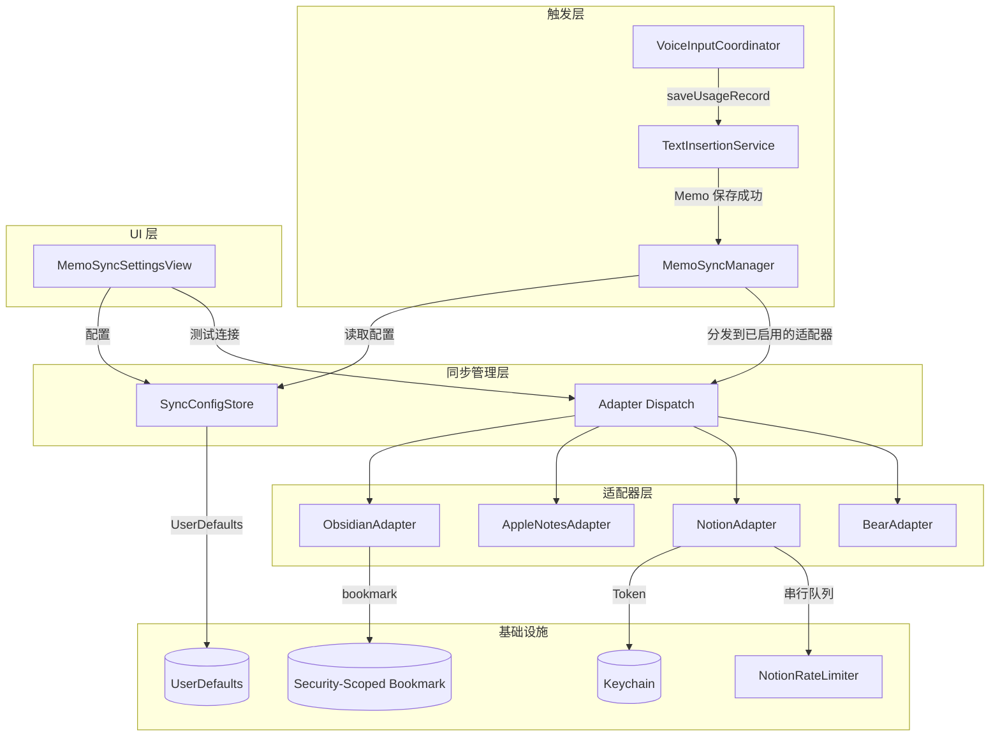
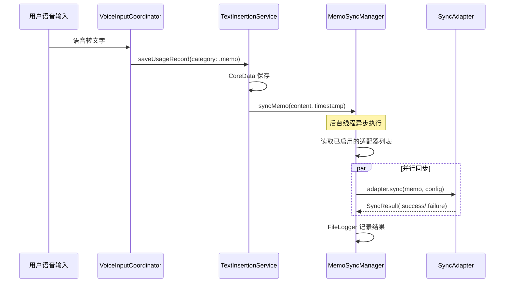

# Quick Memo 同步功能 — 技术设计

## 概述

本功能为 GHOSTYPE 的 Quick Memo 添加单向同步能力，将用户保存的语音笔记自动推送到第三方笔记应用（Obsidian、Apple Notes、Notion、Bear）。

核心设计原则：
- **单向推送**：Memo 保存后推送到目标应用，推送完成后不维护关联
- **无 ID 映射**：每次同步通过标题/文件名实时匹配，不维护映射表
- **仅同步新数据**：启用同步后只处理新保存的 Memo，不回溯历史
- **适配器模式**：统一协议 + 独立适配器，新增笔记应用只需实现协议

### 设计决策

| 决策 | 选择 | 理由 |
|------|------|------|
| 同步方向 | 单向推送 | 简化实现，避免冲突处理 |
| 匹配策略 | 标题/文件名实时匹配 | 无需维护映射表，降低复杂度 |
| Notion 接入 | Internal Integration | 无需 OAuth 服务端，用户自建 Token |
| Obsidian 目录选择 | NSOpenPanel + security-scoped bookmark | macOS 沙盒安全模型标准做法 |
| Token 存储 | Keychain（复用 KeychainHelper） | 已有成熟方案，安全可靠 |
| 配置存储 | UserDefaults（Codable 序列化） | 轻量配置，支持升级场景数据保留 |
| 限流策略 | Notion 串行队列 + Retry-After | 遵循 Notion API 限制（3 req/s） |

---

## 架构

### 整体架构图



### 同步执行流程



---

## 组件与接口

### MemoSyncService 协议

```swift
/// 同步服务统一协议
protocol MemoSyncService {
    /// 服务名称标识
    var serviceName: String { get }
    
    /// 同步单条 Memo
    func sync(memo: MemoSyncPayload, config: SyncAdapterConfig) async -> SyncResult
    
    /// 验证连接状态
    func validateConnection(config: SyncAdapterConfig) async -> SyncResult
}
```

### MemoSyncManager

同步管理器，负责协调触发和分发：

```swift
class MemoSyncManager {
    static let shared = MemoSyncManager()
    
    /// 触发同步（从 TextInsertionService 调用）
    func syncMemo(content: String, timestamp: Date)
    
    /// 获取所有已启用的适配器
    func enabledAdapters() -> [(MemoSyncService, SyncAdapterConfig)]
}
```

调用时机：在 `TextInsertionService.saveUsageRecord` 中，当 `category == .memo` 且 CoreData 保存成功后，调用 `MemoSyncManager.shared.syncMemo(content:timestamp:)`。

### SyncConfigStore

配置管理，基于 UserDefaults + Codable：

```swift
class SyncConfigStore {
    static let shared = SyncConfigStore()
    
    /// 读取指定服务的配置
    func config(for service: SyncServiceType) -> SyncAdapterConfig?
    
    /// 保存配置
    func save(config: SyncAdapterConfig, for service: SyncServiceType)
    
    /// 服务是否已启用
    func isEnabled(_ service: SyncServiceType) -> Bool
    
    /// 启用/禁用服务
    func setEnabled(_ enabled: Bool, for service: SyncServiceType)
    
    /// 获取同步启用时间点（用于过滤历史数据）
    func enabledSince(_ service: SyncServiceType) -> Date?
}
```

### 各适配器接口

#### ObsidianAdapter

```swift
class ObsidianAdapter: MemoSyncService {
    var serviceName: String { "Obsidian" }
    
    /// 通过文件系统写入 Markdown 到 Vault 目录
    /// 使用 security-scoped bookmark 恢复访问权限
    func sync(memo: MemoSyncPayload, config: SyncAdapterConfig) async -> SyncResult
    func validateConnection(config: SyncAdapterConfig) async -> SyncResult
}
```

关键实现：
- 通过 `NSOpenPanel` 选择目录，创建 security-scoped bookmark 持久化
- 写入前 `startAccessingSecurityScopedResource()`，写入后 `stopAccessingSecurityScopedResource()`
- 根据 GroupingMode 决定文件名：每条单独 → 唯一文件名，按天/按周 → 日期/周数文件名
- 追加模式：读取已有文件内容，在末尾追加带时间戳的新内容

#### AppleNotesAdapter

```swift
class AppleNotesAdapter: MemoSyncService {
    var serviceName: String { "Apple Notes" }
    
    /// 通过 AppleScript 创建/追加笔记
    func sync(memo: MemoSyncPayload, config: SyncAdapterConfig) async -> SyncResult
    func validateConnection(config: SyncAdapterConfig) async -> SyncResult
}
```

关键实现：
- 使用 `NSAppleScript` 执行 AppleScript
- 按标题查找已有笔记，找到则追加，找不到则新建
- 默认文件夹 "GHOSTYPE"，用户可自定义
- 内容格式为纯文本，时间戳单独一行

#### NotionAdapter

```swift
class NotionAdapter: MemoSyncService {
    var serviceName: String { "Notion" }
    
    /// 通过 Notion API 同步到指定数据库
    func sync(memo: MemoSyncPayload, config: SyncAdapterConfig) async -> SyncResult
    func validateConnection(config: SyncAdapterConfig) async -> SyncResult
}
```

关键实现：
- Token 通过 `KeychainHelper` 存取
- API 请求通过 `NotionRateLimiter` 串行排队（FIFO）
- 429 响应按 `Retry-After` 延迟重试
- 内容格式：paragraph block，时间戳为 bold text

#### BearAdapter

```swift
class BearAdapter: MemoSyncService {
    var serviceName: String { "Bear" }
    
    /// 通过 x-callback-url 创建/追加笔记
    func sync(memo: MemoSyncPayload, config: SyncAdapterConfig) async -> SyncResult
    func validateConnection(config: SyncAdapterConfig) async -> SyncResult
}
```

关键实现：
- `bear://x-callback-url/create` 创建新笔记
- `bear://x-callback-url/add-text` 追加到已有笔记（通过标题匹配）
- 检测 Bear 是否安装：`NSWorkspace.shared.urlForApplication(withBundleIdentifier:)`
- 支持用户指定默认标签

### NotionRateLimiter

Notion API 限流器：

```swift
actor NotionRateLimiter {
    /// 串行执行 API 请求，遵循 3 req/s 限制
    func execute<T>(_ operation: @escaping () async throws -> T) async throws -> T
}
```

- 使用 Swift Actor 保证线程安全
- FIFO 顺序执行
- 429 响应自动按 Retry-After 重试

### 内容格式化器

```swift
enum MemoContentFormatter {
    /// 格式化 Memo 内容为目标格式
    static func format(
        content: String,
        timestamp: Date,
        target: SyncServiceType
    ) -> String
}
```

各目标格式：
- **Obsidian/Bear (Markdown)**：`**HH:mm**\n\n{content}\n\n`
- **Notion**：paragraph block with bold timestamp
- **Apple Notes**：`HH:mm\n{content}\n\n`

### 标题模板引擎

```swift
enum TitleTemplateEngine {
    /// 解析标题模板，替换变量
    static func resolve(
        template: String,
        date: Date,
        groupingMode: GroupingMode
    ) -> String
}
```

支持变量：`{date}` → `2025-01-15`，`{time}` → `14:32`，`{weekNumber}` → `03`，`{year}` → `2025`

---

## 数据模型

### SyncServiceType

```swift
enum SyncServiceType: String, Codable, CaseIterable {
    case obsidian
    case appleNotes
    case notion
    case bear
}
```

### GroupingMode

```swift
enum GroupingMode: String, Codable {
    case perNote    // 每条单独
    case perDay     // 按天
    case perWeek    // 按周
}
```

### SyncAdapterConfig

```swift
struct SyncAdapterConfig: Codable {
    var groupingMode: GroupingMode
    var titleTemplate: String           // 默认 "GHOSTYPE Memo {date}"
    
    // Obsidian 专用
    var obsidianVaultBookmark: Data?    // security-scoped bookmark
    
    // Apple Notes 专用
    var appleNotesFolderName: String?   // 默认 "GHOSTYPE"
    
    // Notion 专用（Token 存 Keychain，不在此处）
    var notionDatabaseId: String?
    
    // Bear 专用
    var bearDefaultTag: String?         // 默认标签
}
```

### MemoSyncPayload

```swift
struct MemoSyncPayload {
    let content: String
    let timestamp: Date
    let memoId: UUID
}
```

### SyncResult

```swift
enum SyncResult {
    case success
    case failure(SyncError)
}

enum SyncError: Error {
    case pathNotFound(String)
    case noWritePermission(String)
    case bookmarkExpired
    case appleScriptError(String)
    case notionUnauthorized
    case notionDatabaseNotFound
    case notionRateLimited(retryAfter: TimeInterval)
    case notionApiError(String)
    case bearNotInstalled
    case networkError(String)
    case unknown(String)
}
```

### UserDefaults 存储结构

```
Key: "memoSync.config.obsidian"     → SyncAdapterConfig (JSON)
Key: "memoSync.config.appleNotes"   → SyncAdapterConfig (JSON)
Key: "memoSync.config.notion"       → SyncAdapterConfig (JSON)
Key: "memoSync.config.bear"         → SyncAdapterConfig (JSON)
Key: "memoSync.enabled.obsidian"    → Bool
Key: "memoSync.enabled.appleNotes"  → Bool
Key: "memoSync.enabled.notion"      → Bool
Key: "memoSync.enabled.bear"        → Bool
Key: "memoSync.enabledSince.obsidian"   → Date (timeIntervalSince1970)
Key: "memoSync.enabledSince.appleNotes" → Date
Key: "memoSync.enabledSince.notion"     → Date
Key: "memoSync.enabledSince.bear"       → Date
```

Keychain 存储：
```
Key: "memoSync.notion.token"  → Notion Internal Integration Token
```

### 升级兼容性

- 新用户：所有同步默认关闭，无额外数据
- 老用户升级：UserDefaults 中无同步相关 key，等同于全部关闭，不影响现有功能
- 配置使用 Codable + JSONDecoder，未来新增字段设为 Optional 即可向后兼容


---

## 正确性属性（Correctness Properties）

*属性（Property）是系统在所有有效执行中都应保持为真的特征或行为——本质上是对系统应做什么的形式化陈述。属性是人类可读规格说明与机器可验证正确性保证之间的桥梁。*

### Property 1: 标题模板变量替换往返一致性

*For any* 有效日期和包含 `{date}`、`{time}`、`{weekNumber}`、`{year}` 变量的模板字符串，`TitleTemplateEngine.resolve()` 的输出应满足：
- 不包含任何未替换的 `{...}` 变量占位符
- 输出中包含该日期对应的格式化日期字符串
- 对相同日期和模板多次调用应返回相同结果（幂等性）

**Validates: Requirements 6.2**

### Property 2: 配置序列化往返

*For any* 有效的 `SyncAdapterConfig` 实例，通过 JSONEncoder 编码后再通过 JSONDecoder 解码，应得到与原始实例相等的对象。

**Validates: Requirements 6.5**

### Property 3: 分组模式决定 Obsidian 文件数量

*For any* N 条 Memo 和有效的 Vault 目录：
- 当 `groupingMode == .perNote` 时，同步后应产生 N 个独立 .md 文件
- 当 `groupingMode == .perDay` 时，同一天的 Memo 应写入同一个文件（文件数 ≤ 不同天数）
- 当 `groupingMode == .perWeek` 时，同一周的 Memo 应写入同一个文件（文件数 ≤ 不同周数）

**Validates: Requirements 2.2, 2.3, 2.4**

### Property 4: 无效路径返回错误

*For any* 不存在的目录路径或无写入权限的路径，`ObsidianAdapter.sync()` 应返回 `SyncResult.failure`，且错误类型为 `pathNotFound` 或 `noWritePermission`。

**Validates: Requirements 2.5**

### Property 5: Notion HTTP 错误码映射

*For any* Notion API 返回的 HTTP 错误响应：
- 401 状态码应映射为 `SyncError.notionUnauthorized`
- 404 状态码应映射为 `SyncError.notionDatabaseNotFound`
- 429 状态码应映射为 `SyncError.notionRateLimited`，且包含 Retry-After 值

**Validates: Requirements 4.4, 4.5**

### Property 6: Notion Token Keychain 存取往返

*For any* 非空 Token 字符串，通过 `KeychainHelper.save(key: "memoSync.notion.token", value: token)` 保存后，`KeychainHelper.get(key: "memoSync.notion.token")` 应返回相同的 Token 值。

**Validates: Requirements 4.6**

### Property 7: Bear URL scheme 构建

*For any* Memo 内容和配置：
- 当 `groupingMode == .perNote` 时，生成的 URL 应以 `bear://x-callback-url/create` 开头
- 当 `groupingMode == .perDay` 或 `.perWeek` 时，生成的 URL 应以 `bear://x-callback-url/add-text` 开头
- 当配置了 `bearDefaultTag` 时，URL 查询参数应包含该标签

**Validates: Requirements 5.2, 5.3, 5.5**

### Property 8: 内容格式化正确性

*For any* Memo 内容和时间戳，`MemoContentFormatter.format()` 的输出应满足：
- 包含 `HH:mm` 格式的时间字符串（不受 locale 影响）
- Obsidian 目标：时间戳被 `**` 包裹（Markdown 粗体）
- Apple Notes 目标：时间戳在单独一行，内容为纯文本
- Notion 目标：输出为有效的 paragraph block 结构

**Validates: Requirements 14.1, 14.3, 14.4, 14.6, 16.6**

### Property 9: Bear 与 Obsidian 格式一致性

*For any* Memo 内容和时间戳，`MemoContentFormatter.format(target: .bear)` 的输出应与 `MemoContentFormatter.format(target: .obsidian)` 的输出完全相同。

**Validates: Requirements 14.5**

### Property 10: 目标笔记标识生成一致性

*For any* 分组模式、标题模板和日期：
- 相同的 (groupingMode, titleTemplate, date) 组合应生成相同的目标笔记标识
- 不同的分组模式应生成不同的标识（当日期跨越分组边界时）
- 切换分组模式后，新同步应使用新模式生成标识

**Validates: Requirements 11.4, 11.6, 11.7**

### Property 11: 配置独立性

*For any* 两个不同的 `SyncServiceType`，对其中一个保存配置不应影响另一个的配置值。

**Validates: Requirements 6.4**

### Property 12: 历史数据过滤

*For any* 启用时间点 T 和 Memo 列表，`MemoSyncManager` 应仅同步时间戳 > T 的 Memo，时间戳 ≤ T 的 Memo 不应触发任何同步操作。

**Validates: Requirements 15.1, 15.2**

### Property 13: 同步失败不影响本地保存

*For any* 同步适配器返回 failure 的场景，对应的 Memo 应已成功保存在 CoreData 中（同步失败不应回滚本地保存）。

**Validates: Requirements 7.3**

### Property 14: 多适配器并行执行完整性

*For any* N 个已启用的同步适配器，触发同步后应收到恰好 N 个 `SyncResult`（每个适配器一个），不遗漏任何适配器。

**Validates: Requirements 7.5**

### Property 15: Notion 请求 FIFO 顺序

*For any* N 个按顺序提交到 `NotionRateLimiter` 的请求，实际执行顺序应与提交顺序一致（FIFO）。

**Validates: Requirements 13.1, 13.3**

### Property 16: 删除 Memo 不触发目标删除

*For any* 已同步的 Memo，在 GHOSTYPE 中删除该 Memo 后，同步服务不应向任何目标适配器发送删除请求。

**Validates: Requirements 11.2**

### Property 17: 目标笔记不存在时自动新建

*For any* 按天/按周模式下的 Memo，当目标笔记（文件/页面）不存在时，适配器应创建新的同名笔记而非报错。

**Validates: Requirements 11.5**

---

## 错误处理

### 错误分类与处理策略

| 错误类型 | 触发条件 | 处理方式 |
|----------|----------|----------|
| 路径不存在 | Obsidian Vault 目录被移动/删除 | 返回 `pathNotFound`，UI 提示重新选择 |
| 无写入权限 | bookmark 失效 | 返回 `bookmarkExpired`，UI 提示重新授权 |
| AppleScript 失败 | Apple Notes 权限问题或脚本错误 | 返回 `appleScriptError`，记录日志 |
| Token 无效 | Notion Token 过期或被撤销 | 返回 `notionUnauthorized`，UI 提示重新配置 |
| 数据库未找到 | Notion 数据库 ID 错误或未授权 | 返回 `notionDatabaseNotFound`，UI 提示检查配置 |
| API 限流 | Notion 429 响应 | 按 Retry-After 延迟重试 |
| Bear 未安装 | x-callback-url 无法打开 | 返回 `bearNotInstalled`，UI 提示安装 |
| 网络错误 | 无网络连接（Notion） | 返回 `networkError`，下次启动重试 |

### 错误恢复策略

1. **即时重试**：Notion 429 限流 → 按 Retry-After 自动重试
2. **延迟重试**：网络错误、API 临时故障 → 下次应用启动时或用户手动触发重试
3. **用户干预**：Token 过期、路径失效、应用未安装 → UI 提示用户重新配置

### 日志记录

所有同步操作通过 `FileLogger` 记录：
- 成功：`[MemoSync] ✅ {serviceName}: synced "{content_preview}..."`
- 失败：`[MemoSync] ❌ {serviceName}: {error_description}`
- 重试：`[MemoSync] 🔄 {serviceName}: retrying after {delay}s`

---

## 测试策略

### 双轨测试方法

本功能采用单元测试 + 属性测试的双轨策略：

- **单元测试**：验证具体示例、边界条件、错误场景
- **属性测试**：验证跨所有输入的通用属性

### 属性测试配置

- **测试库**：使用 SwiftCheck 或自定义 PropertyTest 框架（项目中已有 `PropertyTest.verify` 模式）
- **每个属性测试最少 100 次迭代**
- **每个属性测试必须引用设计文档中的属性编号**
- **标签格式**：`Feature: memo-sync, Property {number}: {property_text}`
- **每个正确性属性由一个属性测试实现**

### 测试分层

#### 纯函数测试（属性测试重点）

这些组件是纯函数或近似纯函数，最适合属性测试：

1. `TitleTemplateEngine.resolve()` → Property 1
2. `SyncAdapterConfig` Codable 往返 → Property 2
3. `MemoContentFormatter.format()` → Property 8, 9
4. Bear URL 构建逻辑 → Property 7
5. Notion HTTP 错误码映射 → Property 5
6. 目标笔记标识生成 → Property 10

#### 状态测试（单元测试 + 属性测试）

1. `SyncConfigStore` 配置存取 → Property 2, 11
2. `KeychainHelper` Token 存取 → Property 6
3. 历史数据过滤逻辑 → Property 12
4. `NotionRateLimiter` FIFO 顺序 → Property 15

#### 集成测试（单元测试为主）

1. `ObsidianAdapter` 文件系统读写 → Property 3, 4, 17（使用临时目录）
2. `MemoSyncManager` 触发与分发 → Property 13, 14, 16
3. 同步失败不影响本地保存 → Property 13

#### 不测试范围

- AppleScript 执行（依赖 Apple Notes 运行时）
- Notion API 实际调用（依赖外部服务）
- Bear x-callback-url 实际打开（依赖 Bear 应用）
- UI 布局和视觉反馈
- security-scoped bookmark 系统 API 行为
