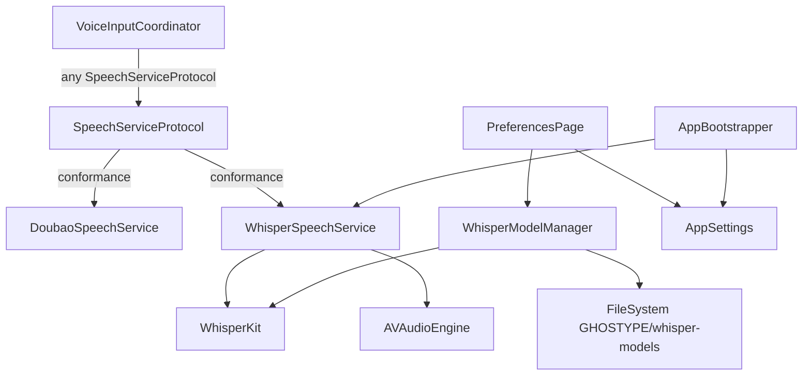

# Design — 本地 Whisper ASR 支持

## Overview

在现有豆包 ASR 之上引入 `SpeechServiceProtocol`，使 `VoiceInputCoordinator` 对引擎无感知。新增 `WhisperSpeechService`（录音 + WhisperKit 批量推理）和 `WhisperModelManager`（模型下载/删除/状态追踪）。在 `PreferencesPage` 新增「语音识别」设置区。App 启动时后台预加载已选定的 Whisper 模型。

### 设计决策

1. **WhisperKit via Swift Package Manager** — 原生 Swift，CoreML+Metal，无 Python/C++ 桥接，与项目 macOS 14+ 目标完全匹配
2. **批量转写（非流式）** — WhisperKit 的流式 API 尚不稳定；PTT 结束后把整段 PCM buffer 一次送入推理，简单可靠
3. **`cancelRecording()` 独立于 `stopRecording()`** — ESC 时需要丢弃 buffer 不触发推理；Doubao 的 cancel 等同于 stop（结果被状态机忽略），但 Whisper 需要显式区分
4. **`VoiceInputCoordinator.speechService` 改为 `var`** — 支持运行时热切换（只在 `.idle` 状态才允许切换），避免重启 App
5. **模型存储路径自定义** — WhisperKit 支持 `modelFolder` 参数，指向 `~/Library/Application Support/GHOSTYPE/whisper-models/`，用户可见、可管理
6. **`WhisperModelManager` 为独立单例** — 与 `WhisperSpeechService` 解耦，UI 层直接绑定它的 `@Published` 状态

---

## Architecture



---

## Components and Interfaces

### SpeechServiceProtocol
**新文件：** `Sources/Features/Speech/SpeechServiceProtocol.swift`

```swift
protocol SpeechServiceProtocol: AnyObject {
    /// 最终识别结果（Doubao: utterance 结束；Whisper: 推理完成）
    var onFinalResult: ((String) -> Void)? { get set }
    /// 中间流式结果（Whisper v1 不实现，传空字符串）
    var onPartialResult: ((String) -> Void)? { get set }

    /// 开始录音（Doubao: 建立 WebSocket；Whisper: 启动 AVAudioEngine tap）
    func startRecording()
    /// 停止录音并触发识别（松开快捷键时调用）
    func stopRecording()
    /// 取消录音，丢弃所有已录音频，不触发识别（ESC 时调用）
    func cancelRecording()
}
```

### DoubaoSpeechService（修改）
**文件：** `Sources/Features/Speech/DoubaoSpeechService.swift`

- 添加 `: SpeechServiceProtocol` conformance
- 添加 `cancelRecording()` — 实现与 `stopRecording()` 相同（ASR 结果会被状态机忽略，协议语义满足即可）

### WhisperSpeechService（新建）
**文件：** `Sources/Features/Speech/WhisperSpeechService.swift`

```swift
final class WhisperSpeechService: SpeechServiceProtocol {
    var onFinalResult: ((String) -> Void)?
    var onPartialResult: ((String) -> Void)?

    private let modelId: String           // e.g. "openai_whisper-small"
    private let language: String          // "auto"/"zh"/"en"/"ja"
    private let temperature: Float

    private var whisperKit: WhisperKit?   // 加载后持久持有
    private var audioEngine: AVAudioEngine?
    private var audioBuffer: [Float] = [] // 16kHz PCM，录音期间累积
    private var isRecording = false
    private var isCancelled = false       // cancelRecording() 标志，防止 stopRecording 并发触发推理

    /// 加载模型到内存（App 启动时后台调用）
    func preload() async throws

    func startRecording()    // 启动 AVAudioEngine，清空 buffer
    func stopRecording()     // 停止引擎，调用 transcribe()
    func cancelRecording()   // 停止引擎，设 isCancelled=true，清空 buffer

    private func transcribe() async   // WhisperKit 推理，调用 onFinalResult
}
```

**录音流程：**
1. `startRecording()` — `AVAudioEngine.inputNode` 安装 tap，格式为 native（不强制 16kHz），用 `AVAudioConverter` 转为 16kHz Float PCM，append 到 `audioBuffer`
2. `stopRecording()` — removeTap，stop engine，调用 `Task { await transcribe() }`
3. `transcribe()` — 检查 `isCancelled`；buffer < 0.3s（4800 帧）则直接 `onFinalResult("")`；否则调用 `whisperKit.transcribe(audioArray: audioBuffer, decodeOptions:)`；结果取 `segments.map(\.text).joined()` 传给 `onFinalResult`

### WhisperModelManager（新建）
**文件：** `Sources/Features/Speech/WhisperModelManager.swift`

```swift
@Observable
final class WhisperModelManager {
    static let shared = WhisperModelManager()

    /// 4 个支持的模型规格
    static let supportedModels: [WhisperModelInfo] = [
        WhisperModelInfo(id: "openai_whisper-tiny",           displayName: "Tiny",           sizeEstimate: "~150 MB", qualityNote: "速度最快，英文效果好"),
        WhisperModelInfo(id: "openai_whisper-small",          displayName: "Small",          sizeEstimate: "~500 MB", qualityNote: "均衡，推荐默认"),
        WhisperModelInfo(id: "openai_whisper-medium",         displayName: "Medium",         sizeEstimate: "~1.5 GB", qualityNote: "准确率高，中文更优"),
        WhisperModelInfo(id: "openai_whisper-large-v3-turbo", displayName: "Large v3 Turbo", sizeEstimate: "~1.6 GB", qualityNote: "最高质量"),
    ]

    /// 每个模型的当前状态，key = model id
    private(set) var statuses: [String: ModelDownloadStatus] = [:]

    var modelsDirectory: URL  // ~/Library/Application Support/GHOSTYPE/whisper-models/

    func refreshStatuses()                        // 扫描磁盘，更新 statuses
    func download(modelId: String) async throws   // 调用 WhisperKit.download，更新进度
    func cancelDownload(modelId: String)          // 取消进行中的下载 Task
    func delete(modelId: String) throws           // 删除磁盘文件，更新状态
    func isDownloaded(modelId: String) -> Bool
    func modelFolder(for modelId: String) -> URL  // modelsDirectory/{modelId}
}

struct WhisperModelInfo {
    let id: String
    let displayName: String
    let sizeEstimate: String
    let qualityNote: String
}

enum ModelDownloadStatus: Equatable {
    case notDownloaded
    case downloading(progress: Double)
    case downloaded
    case error(String)
}
```

### AppSettings（修改）
**文件：** `Sources/Features/Settings/AppSettings.swift`

新增 4 个 `@Published` 属性：

```swift
@Published var asrEngine: ASREngine { didSet { debouncedSave() } }
@Published var whisperModelId: String { didSet { debouncedSave() } }
@Published var whisperLanguage: String { didSet { debouncedSave() } }  // "auto"/"zh"/"en"/"ja"
@Published var whisperTemperature: Double { didSet { debouncedSave() } }

enum ASREngine: String, CaseIterable {
    case doubao = "doubao"
    case whisper = "whisper"
}
```

UserDefaults keys: `asrEngine`, `whisperModelId`, `whisperLanguage`, `whisperTemperature`
默认值：`doubao`, `"openai_whisper-small"`, `"auto"`, `0.0`

### VoiceInputCoordinator（修改）
**文件：** `Sources/Features/VoiceInput/VoiceInputCoordinator.swift`

```swift
// let → var
var speechService: any SpeechServiceProtocol

// 新方法：热切换引擎（仅在 .idle 时生效）
func updateSpeechService(_ newService: any SpeechServiceProtocol) {
    guard case .idle = recordingState else { return }
    speechService = newService
    setupSpeechCallbacks()  // 重新绑定 onFinalResult / onPartialResult
}
```

`handleEscCancel()` 改为调用 `speechService.cancelRecording()`（而非 `stopRecording()`）。

`fetchCredentials` 调用（仅 Doubao 有）移至 AppBootstrapper 的观察者里，通过类型判断：
```swift
if let doubao = coordinator.speechService as? DoubaoSpeechService {
    Task { try? await doubao.fetchCredentials() }
}
```

### AppBootstrapper（修改）
**文件：** `Sources/Features/App/AppBootstrapper.swift`

`bootstrapInputServices` 中：

```swift
// 根据设置创建对应的 speech service
let activeSpeechService: any SpeechServiceProtocol
if AppSettings.shared.asrEngine == .whisper {
    let svc = WhisperSpeechService(
        modelId: AppSettings.shared.whisperModelId,
        language: AppSettings.shared.whisperLanguage,
        temperature: Float(AppSettings.shared.whisperTemperature)
    )
    Task { try? await svc.preload() }  // 后台预加载
    activeSpeechService = svc
} else {
    activeSpeechService = delegate.speechService  // DoubaoSpeechService
}
delegate.voiceCoordinator = VoiceInputCoordinator(
    speechService: activeSpeechService, ...
)
```

`bootstrapObservers` 中订阅 `asrEngine` 变化，动态切换：

```swift
AppSettings.shared.$asrEngine
    .dropFirst()
    .receive(on: DispatchQueue.main)
    .sink { [weak delegate] newEngine in
        let newService = Self.makeSpeechService(engine: newEngine)
        delegate?.voiceCoordinator.updateSpeechService(newService)
    }
    .store(in: &cancellables)
```

### PreferencesPage（修改）
**文件：** `Sources/UI/Dashboard/Pages/PreferencesPage.swift`

在 `hotkeySettingsSection` 之后插入新的 `asrSettingsSection`：

```
┌─ 语音识别引擎 ─────────────────────────────┐
│  [豆包云端 ▼ / 本地 Whisper]              │
│                                          │
│  ▾ 本地 Whisper（仅选中时展开）           │
│  ┌─ 模型 ──────────────────────────────┐ │
│  │  ○ Tiny     ~150MB  速度最快        │ │
│  │  ● Small    ~500MB  均衡 推荐 ✓下载  │ │
│  │  ○ Medium   ~1.5GB  准确率高   [下载]│ │
│  │  ○ L-Turbo  ~1.6GB  最高质量  [下载]│ │
│  └─────────────────────────────────────┘ │
│  语言      [自动检测 ▼]                   │
│  精确度    ○────●────○  0.3              │
└──────────────────────────────────────────┘
```

新增 `PreferencesViewModel` 属性：
```swift
var asrEngine: ASREngine
var whisperModelId: String
var whisperLanguage: String
var whisperTemperature: Double
```

### Package.swift（修改）

```swift
dependencies: [
    .package(url: "https://github.com/argmaxinc/WhisperKit", from: "0.9.0")
],
targets: [
    .executableTarget(
        name: "AIInputMethod",
        dependencies: [
            .product(name: "WhisperKit", package: "WhisperKit")
        ],
        ...
    )
]
```

---

## Data Models

```swift
// ASR 引擎枚举（存入 UserDefaults raw value）
enum ASREngine: String, CaseIterable {
    case doubao = "doubao"
    case whisper = "whisper"

    var displayName: String {
        switch self {
        case .doubao: return "豆包云端"
        case .whisper: return "本地 Whisper"
        }
    }
}

// Whisper 语言选项
struct WhisperLanguageOption: Identifiable {
    let id: String       // "auto"/"zh"/"en"/"ja"
    let displayName: String
}

// 模型信息（静态数据）
struct WhisperModelInfo: Identifiable {
    let id: String
    let displayName: String
    let sizeEstimate: String
    let qualityNote: String
}
```

---

## Correctness Properties

### Property 1: 协议透明性
*For any* `SpeechServiceProtocol` 实现，`VoiceInputCoordinator` 的行为 should 与使用 `DoubaoSpeechService` 时完全一致（相同的状态机转换）。

**Validates: Requirements 1.1, 1.3**

### Property 2: Cancel 不触发推理
*For any* 调用 `cancelRecording()` 后，`onFinalResult` SHALL NOT be called（无论 buffer 是否为空）。

**Validates: Requirements 2.7**

### Property 3: 空 buffer 安全
*For any* 录音时长 < 0.3 秒，`stopRecording()` SHALL call `onFinalResult("")`（不崩溃，不挂起）。

**Validates: Requirements 2.3, 异常边界**

### Property 4: 模型状态一致性
*For any* 模型 ID，`WhisperModelManager.isDownloaded()` 的返回值 SHALL 与磁盘上 `modelFolder(for:)` 目录是否存在保持一致。

**Validates: Requirements 3.7**

### Property 5: 设置持久性
*For any* `asrEngine` / `whisperModelId` / `whisperLanguage` / `whisperTemperature` 的值，重启 App 后读取的值 SHALL 与写入时一致。

**Validates: Requirements 4.6**

---

## Error Handling

| 层级 | 错误场景 | 处理 |
|------|---------|------|
| `WhisperSpeechService` | 模型未加载（`whisperKit == nil`） | `onFinalResult("")`，Overlay 状态机走 empty-text 分支 |
| `WhisperSpeechService` | 推理异常（throw） | catch → `onFinalResult("")` |
| `WhisperSpeechService` | 推理超时（> 30s） | `Task.cancel()` → `onFinalResult("")` |
| `WhisperModelManager` | 下载失败（网络/磁盘） | `statuses[id] = .error(message)`，UI 显示错误 + 重试 |
| `WhisperModelManager` | 磁盘不足 | 预检测空间，提前设 `.error("磁盘空间不足")` |
| `AppBootstrapper` | Whisper preload 失败 | 仅 log，不 crash；首次录音时再尝试加载 |

---

## Testing Strategy

### 测试框架
Swift Testing（已有），SwiftCheck 用于属性测试。

### 单元测试覆盖

**`WhisperSpeechServiceTests`**
- `cancelRecording()` 后 `onFinalResult` 不被调用（Property 2）
- buffer < 0.3s 时 `stopRecording()` 触发 `onFinalResult("")`（Property 3）
- 使用 mock `WhisperKit`，不做真实推理

**`WhisperModelManagerTests`**
- `isDownloaded()` 与磁盘状态一致（Property 4）
- `delete()` 后 status 变为 `.notDownloaded`
- `refreshStatuses()` 扫描临时目录，状态正确

**`SpeechServiceProtocolTests`**
- `DoubaoSpeechService` 和 stub `WhisperSpeechService` 均满足 Property 1（通过 mock coordinator 验证状态机）

### 测试文件组织

```
Tests/
├── SpeechServiceProtocolTests.swift   (Property 1)
├── WhisperSpeechServiceTests.swift    (Property 2, 3)
└── WhisperModelManagerTests.swift     (Property 4, 5)
```
