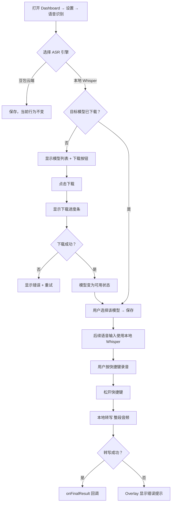

# Requirements — 本地 Whisper ASR 支持

## Introduction

在 GHOSTYPE 现有的豆包云端 ASR 基础上，增加本地 Whisper 模型作为可选的语音识别引擎。用户可以在「设置」中切换 ASR 引擎、下载模型、调整参数。

**做什么：**
- 支持 WhisperKit（Apple Silicon 原生 CoreML/Metal 加速）
- 支持 4 个模型规格：tiny / small / medium / large-v3-turbo
- 在 Dashboard 设置页添加「语音识别引擎」配置区
- 模型文件下载到本地（`~/Library/Application Support/GHOSTYPE/whisper-models/`）
- 切换引擎后语音输入流程不变（对 VoiceInputCoordinator 透明）

**不做什么：**
- 不支持 Windows/Linux（macOS 专属）
- 不支持 Python whisper / whisper.cpp（只用 WhisperKit）
- 不做云端模型托管（直接从 Hugging Face 下载，WhisperKit 内置）
- 本次不做实时流式转写（WhisperKit 目前流式支持有限，用 Push-to-Talk 结束后转写）

**重要约束：**
- 切换引擎的 API 对 `VoiceInputCoordinator` 完全透明，引入 `SpeechServiceProtocol`
- 本地模式下无网络要求（已下载模型后完全离线）
- 豆包引擎保持不变，不影响现有功能

---

## Glossary

- **ASR 引擎（ASR Engine）**：语音识别后端，当前有「豆包云端」和「本地 Whisper」两种
- **WhisperKit**：Argmax 开发的 Swift 原生 Whisper 推理库，使用 CoreML + Metal
- **模型规格（Model Variant）**：tiny / small / medium / large-v3-turbo，对应不同的大小和精度
- **模型目录**：`~/Library/Application Support/GHOSTYPE/whisper-models/`，存放下载的 CoreML 模型包
- **Push-to-Talk 转写**：用户松开快捷键后，将整段录音一次性送入本地模型转写（非流式）

---

## 用户流程

---

## Requirements

### Requirement 1：ASR 引擎抽象层

**User Story:** As a developer, I want a protocol that abstracts both Doubao and local Whisper, so that VoiceInputCoordinator doesn't need to know which engine is active.

#### Acceptance Criteria

1. WHEN any ASR engine is used, THE `SpeechServiceProtocol` SHALL expose `startRecording()`, `stopRecording()`, `cancelRecording()`, `onFinalResult`, `onPartialResult` — 与现有 `DoubaoSpeechService` 公开 API 一致
2. THE `DoubaoSpeechService` SHALL conform to `SpeechServiceProtocol` without changing its existing behavior
3. THE `VoiceInputCoordinator` SHALL reference `any SpeechServiceProtocol` instead of `DoubaoSpeechService` directly
4. WHEN the engine is switched in settings, THE `AppDelegate` SHALL replace the active speech service instance; `VoiceInputCoordinator` SHALL receive the new instance without restart

#### 数据字段说明

| 字段 | 类型 | 说明 |
|------|------|------|
| `onFinalResult` | `((String) -> Void)?` | 最终识别结果回调 |
| `onPartialResult` | `((String) -> Void)?` | 中间结果回调（本地引擎可返回空） |
| `startRecording()` | `func` | 开始录音 |
| `stopRecording()` | `func` | 停止录音，触发识别 |
| `cancelRecording()` | `func` | 取消录音，丢弃音频 |

---

### Requirement 2：本地 Whisper 引擎（WhisperSpeechService）

**User Story:** As a user, I want voice input to work entirely offline using a local Whisper model, so that I don't depend on network connectivity or cloud services.

#### Acceptance Criteria

1. WHEN the user selects local Whisper engine and a model is downloaded, THE `WhisperSpeechService` SHALL record audio via `AVAudioEngine`, buffer it in memory, and run WhisperKit inference after `stopRecording()` is called
2. THE `WhisperSpeechService` SHALL call `onFinalResult` with the transcribed text upon successful inference
3. IF inference fails, THE `WhisperSpeechService` SHALL call `onFinalResult("")` so the coordinator's empty-text guard handles it gracefully
4. THE `WhisperSpeechService` SHALL respect the configured language setting (`auto` / `zh` / `en` / `ja`)
5. THE `WhisperSpeechService` SHALL respect the configured temperature (0.0–1.0)
6. WHILE recording, THE `onPartialResult` SHALL NOT be called (batch mode only in v1)
7. THE audio buffer SHALL be cleared on `cancelRecording()`

#### 交互规格

**交互 2.1: 松开快捷键触发本地转写**

| 要素 | 内容 |
|------|------|
| **触发** | 用户松开快捷键（`stopRecording()` 被调用） |
| **前置条件** | 已录制音频 > 0.3 秒；模型已加载 |
| **处理** | 将 PCM buffer 送入 WhisperKit 推理；Overlay 保持「处理中」状态 |
| **成功结果** | `onFinalResult(text)` 被调用，Overlay 消失，文字上屏 |
| **失败结果** | `onFinalResult("")` 被调用，Overlay 消失，无文字输出（不崩溃） |
| **补充说明** | 推理在后台线程执行，不阻塞主线程；超时 30s 强制返回空 |

---

### Requirement 3：模型管理

**User Story:** As a user, I want to download and manage Whisper model files from the settings UI, so that I can control which model is stored on my disk.

#### Acceptance Criteria

1. THE settings UI SHALL display a model list with 4 options: `tiny`、`small`、`medium`、`large-v3-turbo`
2. FOR EACH model, THE UI SHALL show: 模型名称、大小估算、质量说明、下载状态（未下载 / 下载中 % / 已下载）
3. WHEN a model is not downloaded, THE UI SHALL show a「下载」按钮
4. WHEN download is in progress, THE UI SHALL show a进度条 and「取消」按钮
5. WHEN a model is downloaded, THE UI SHALL show「已下载」Badge 和「删除」按钮
6. WHEN the user clicks「删除」, THE system SHALL delete the model files from disk and update status to「未下载」; IF the deleted model is currently active, THE system SHALL fallback to Doubao engine
7. THE model files SHALL be stored at `~/Library/Application Support/GHOSTYPE/whisper-models/{model-name}/`
8. IF download fails (network error / disk full), THE UI SHALL show an inline error message with「重试」button

#### 数据字段说明

| 字段 | 类型 | 说明 | 示例 |
|------|------|------|------|
| `id` | `String` | WhisperKit model identifier | `"openai_whisper-tiny"` |
| `displayName` | `String` | UI 显示名称 | `"Tiny"` |
| `sizeEstimate` | `String` | 磁盘占用估算 | `"~150 MB"` |
| `qualityNote` | `String` | 质量说明 | `"速度最快，适合英文"` |
| `downloadStatus` | `enum` | `notDownloaded` / `downloading(progress: Double)` / `downloaded` | — |

---

### Requirement 4：引擎设置 UI

**User Story:** As a user, I want a dedicated section in Dashboard settings to choose my ASR engine and configure Whisper parameters, so that I can tailor speech recognition to my needs.

#### Acceptance Criteria

1. THE Dashboard 「设置」页 SHALL contain a「语音识别」section，位于现有快捷键设置之后
2. THE section SHALL show a Picker 切换「豆包云端」/「本地 Whisper」
3. WHEN「本地 Whisper」is selected, THE section SHALL expand to show：模型选择器、下载管理、参数配置
4. THE parameter configuration SHALL expose：
   - **语言**：Picker，选项 `自动检测` / `中文` / `英文` / `日文`
   - **Temperature**：Slider，范围 0.0–1.0，步长 0.1，默认 0.0
5. WHEN the engine is changed, THE change SHALL take effect on the **next** voice input session (not mid-session)
6. ALL settings SHALL persist to `AppSettings` (UserDefaults key: `asrEngine`, `whisperModelId`, `whisperLanguage`, `whisperTemperature`)
7. IF local Whisper is selected but no model is downloaded, THE Picker SHALL show a warning indicator and prevent saving until a model is downloaded

#### 数据字段说明

| UserDefaults Key | 类型 | 默认值 | 说明 |
|-----------------|------|--------|------|
| `asrEngine` | `String` | `"doubao"` | `"doubao"` \| `"whisper"` |
| `whisperModelId` | `String` | `"openai_whisper-small"` | WhisperKit model ID |
| `whisperLanguage` | `String` | `"auto"` | `"auto"` \| `"zh"` \| `"en"` \| `"ja"` |
| `whisperTemperature` | `Double` | `0.0` | 0.0 – 1.0 |

---

## 异常与边界

- **模型未加载时触发录音**：若用户切换到 Whisper 引擎但模型尚未完成加载（首次冷启动），`WhisperSpeechService.startRecording()` SHALL 立即调用 `onFinalResult("")` 并在 Overlay 显示「模型加载中，请稍候」
- **磁盘空间不足**：下载时检测剩余空间，若 < 模型大小 × 1.5 倍，SHALL 提前中止并显示「磁盘空间不足」
- **下载中断恢复**：断点续传由 WhisperKit 内置处理；若不支持则重新下载
- **音频为空**：录音时长 < 0.3s，`stopRecording()` SHALL 直接调用 `onFinalResult("")`
- **Intel Mac**：WhisperKit 在 Intel 上仍可运行（CPU 推理），但速度明显慢，UI 显示「推荐在 Apple Silicon Mac 上使用」提示（不禁用）
- **并发保护**：`WhisperSpeechService` 持有互斥锁，防止同时调用 `startRecording()` 多次

---

## 待确认事项

1. **模型下载源**：WhisperKit 默认从 Hugging Face 下载，国内网络可能较慢。是否需要备用镜像或提示用户使用代理？
2. **模型预加载时机**：App 启动时预加载选定模型（减少首次录音延迟）还是首次录音时才加载？推荐：启动时后台预加载。
3. **Overlay 转写进度**：本地转写可能需要 1–5 秒，Overlay 是否显示「转写中...」动画（区别于云端的「处理中」）？
4. **语言设置**：当前豆包也有语言相关逻辑，Whisper 的语言设置是否与豆包共享，还是各自独立？推荐：各自独立。
